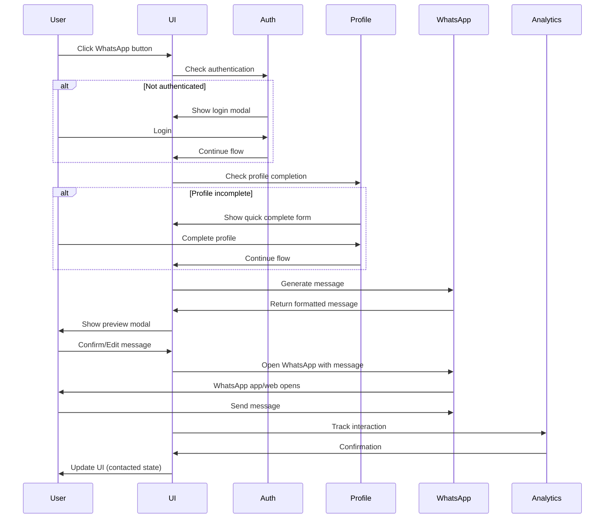

# WhatsApp Integration - Implementation Guide

## Overview
Technical implementation specifications for integrating WhatsApp messaging throughout the HEUREKKA platform, including component architecture, API integration, and performance optimizations.

## Table of Contents
1. [Component Architecture](#component-architecture)
2. [API Integration](#api-integration)
3. [State Management](#state-management)
4. [Data Flow](#data-flow)
5. [Performance Optimization](#performance-optimization)
6. [Testing Strategy](#testing-strategy)
7. [Deployment Checklist](#deployment-checklist)

## Component Architecture

### Core Components

#### WhatsAppButton Component
```typescript
interface WhatsAppButtonProps {
  propertyId: string;
  landlordPhone: string;
  variant?: 'primary' | 'secondary' | 'icon';
  size?: 'small' | 'medium' | 'large';
  fullWidth?: boolean;
  disabled?: boolean;
  className?: string;
  onClick?: () => void;
}

const WhatsAppButton: React.FC<WhatsAppButtonProps> = ({
  propertyId,
  landlordPhone,
  variant = 'primary',
  size = 'medium',
  fullWidth = false,
  disabled = false,
  className = '',
  onClick
}) => {
  const [loading, setLoading] = useState(false);
  const [contacted, setContacted] = useState(false);
  const { user, profile } = useAuth();
  
  const handleClick = async () => {
    setLoading(true);
    
    try {
      // Check authentication
      if (!user) {
        openAuthModal();
        return;
      }
      
      // Check profile completion
      if (!isProfileComplete(profile)) {
        openProfileModal();
        return;
      }
      
      // Generate message
      const message = await generateWhatsAppMessage({
        propertyId,
        profile
      });
      
      // Open WhatsApp
      const url = buildWhatsAppURL(landlordPhone, message);
      window.open(url, '_blank');
      
      // Track interaction
      trackWhatsAppContact(propertyId);
      setContacted(true);
      
      // Custom onClick handler
      onClick?.();
    } catch (error) {
      handleError(error);
    } finally {
      setLoading(false);
    }
  };
  
  return (
    <button
      className={cn(
        'whatsapp-button',
        `whatsapp-button--${variant}`,
        `whatsapp-button--${size}`,
        {
          'whatsapp-button--full': fullWidth,
          'whatsapp-button--loading': loading,
          'whatsapp-button--contacted': contacted
        },
        className
      )}
      onClick={handleClick}
      disabled={disabled || loading}
      aria-label="Contactar por WhatsApp"
    >
      {loading ? (
        <Spinner size={size} />
      ) : (
        <>
          <WhatsAppIcon />
          <span>{contacted ? 'Contactado' : 'Contactar por WhatsApp'}</span>
        </>
      )}
    </button>
  );
};
```

#### MessagePreviewModal Component
```typescript
interface MessagePreviewModalProps {
  isOpen: boolean;
  onClose: () => void;
  property: Property;
  profile: UserProfile;
  onSend: (message: string) => void;
}

const MessagePreviewModal: React.FC<MessagePreviewModalProps> = ({
  isOpen,
  onClose,
  property,
  profile,
  onSend
}) => {
  const [message, setMessage] = useState('');
  const [isEditing, setIsEditing] = useState(false);
  const [charCount, setCharCount] = useState(0);
  const maxChars = 1024;
  
  useEffect(() => {
    if (isOpen) {
      const generatedMessage = generateMessage(property, profile);
      setMessage(generatedMessage);
      setCharCount(generatedMessage.length);
    }
  }, [isOpen, property, profile]);
  
  const handleEdit = () => {
    setIsEditing(true);
  };
  
  const handleSave = () => {
    setIsEditing(false);
  };
  
  const handleSend = () => {
    onSend(message);
    trackMessageSent(property.id);
    onClose();
  };
  
  const handleCopy = async () => {
    await navigator.clipboard.writeText(message);
    toast.success('Mensaje copiado');
  };
  
  return (
    <Modal
      isOpen={isOpen}
      onClose={onClose}
      title="Vista previa del mensaje"
      size="medium"
    >
      <div className="message-preview-modal">
        <div className="message-preview-header">
          <WhatsAppIcon size={24} />
          <span>Mensaje para {property.landlordName}</span>
        </div>
        
        <div className="message-preview-content">
          {isEditing ? (
            <textarea
              value={message}
              onChange={(e) => {
                setMessage(e.target.value);
                setCharCount(e.target.value.length);
              }}
              maxLength={maxChars}
              className="message-editor"
              autoFocus
            />
          ) : (
            <div 
              className="message-bubble"
              onDoubleClick={handleEdit}
            >
              {message}
            </div>
          )}
        </div>
        
        <div className={cn('character-counter', {
          'warning': charCount > maxChars - 100,
          'error': charCount > maxChars
        })}>
          {maxChars - charCount} caracteres restantes
        </div>
        
        <div className="message-preview-actions">
          <Button
            variant="secondary"
            onClick={handleCopy}
            icon={<CopyIcon />}
          >
            Copiar
          </Button>
          
          {isEditing ? (
            <Button
              variant="primary"
              onClick={handleSave}
            >
              Guardar cambios
            </Button>
          ) : (
            <Button
              variant="primary"
              onClick={handleEdit}
            >
              Editar
            </Button>
          )}
          
          <Button
            variant="whatsapp"
            onClick={handleSend}
            disabled={charCount > maxChars}
            icon={<WhatsAppIcon />}
          >
            Enviar por WhatsApp
          </Button>
        </div>
      </div>
    </Modal>
  );
};
```

#### ProfileQuickComplete Component
```typescript
interface ProfileQuickCompleteProps {
  onComplete: (profile: Partial<UserProfile>) => void;
  onSkip?: () => void;
  required?: boolean;
}

const ProfileQuickComplete: React.FC<ProfileQuickCompleteProps> = ({
  onComplete,
  onSkip,
  required = true
}) => {
  const [formData, setFormData] = useState<Partial<UserProfile>>({
    budget: '',
    moveDate: '',
    occupants: 1,
    areas: []
  });
  const [errors, setErrors] = useState<Record<string, string>>({});
  const [saving, setSaving] = useState(false);
  
  // Auto-save to localStorage
  useEffect(() => {
    const saved = localStorage.getItem('profileDraft');
    if (saved) {
      setFormData(JSON.parse(saved));
    }
  }, []);
  
  useEffect(() => {
    const timeout = setTimeout(() => {
      localStorage.setItem('profileDraft', JSON.stringify(formData));
    }, 1000);
    
    return () => clearTimeout(timeout);
  }, [formData]);
  
  const validateField = (field: string, value: any): string | null => {
    switch (field) {
      case 'budget':
        const budget = parseInt(value);
        if (budget < 3000) return 'Presupuesto mínimo: L.3,000';
        if (budget > 100000) return 'Presupuesto máximo: L.100,000';
        return null;
        
      case 'moveDate':
        const date = new Date(value);
        const today = new Date();
        const maxDate = new Date();
        maxDate.setMonth(maxDate.getMonth() + 6);
        
        if (date < today) return 'La fecha no puede ser en el pasado';
        if (date > maxDate) return 'Máximo 6 meses en el futuro';
        return null;
        
      default:
        return null;
    }
  };
  
  const handleSubmit = async () => {
    // Validate all fields
    const newErrors: Record<string, string> = {};
    Object.keys(formData).forEach(field => {
      const error = validateField(field, formData[field]);
      if (error) newErrors[field] = error;
    });
    
    if (Object.keys(newErrors).length > 0) {
      setErrors(newErrors);
      return;
    }
    
    setSaving(true);
    try {
      await onComplete(formData);
      localStorage.removeItem('profileDraft');
    } finally {
      setSaving(false);
    }
  };
  
  const progress = calculateProgress(formData);
  
  return (
    <div className="profile-quick-complete">
      <div className="quick-complete-header">
        <WarningIcon />
        <div>
          <h3>Complete tu perfil para continuar</h3>
          <p>Solo necesitamos algunos datos básicos</p>
        </div>
      </div>
      
      <ProgressBar value={progress} />
      
      <div className="quick-form-grid">
        <FormField
          label="Presupuesto mensual"
          required
          error={errors.budget}
        >
          <CurrencyInput
            value={formData.budget}
            onChange={(value) => {
              setFormData({ ...formData, budget: value });
              const error = validateField('budget', value);
              setErrors({ ...errors, budget: error });
            }}
            placeholder="L.0"
          />
        </FormField>
        
        <FormField
          label="Fecha de mudanza"
          required
          error={errors.moveDate}
        >
          <DatePicker
            value={formData.moveDate}
            onChange={(date) => {
              setFormData({ ...formData, moveDate: date });
              const error = validateField('moveDate', date);
              setErrors({ ...errors, moveDate: error });
            }}
            min={new Date().toISOString().split('T')[0]}
            max={addMonths(new Date(), 6).toISOString().split('T')[0]}
          />
        </FormField>
        
        <FormField
          label="Número de ocupantes"
          required
        >
          <NumberInput
            value={formData.occupants}
            onChange={(value) => setFormData({ ...formData, occupants: value })}
            min={1}
            max={10}
          />
        </FormField>
        
        <FormField
          label="Zonas de interés"
          required
        >
          <AreaSelector
            value={formData.areas}
            onChange={(areas) => setFormData({ ...formData, areas })}
            multiple
          />
        </FormField>
      </div>
      
      <div className="quick-complete-actions">
        {!required && (
          <Button
            variant="ghost"
            onClick={onSkip}
          >
            Omitir por ahora
          </Button>
        )}
        
        <Button
          variant="primary"
          onClick={handleSubmit}
          loading={saving}
          disabled={progress < 100}
        >
          {progress < 100 
            ? `Completar (${Math.floor(progress)}%)`
            : 'Continuar'
          }
        </Button>
      </div>
    </div>
  );
};
```

## API Integration

### WhatsApp URL Generation
```typescript
// WhatsApp URL builder service
export class WhatsAppService {
  private static readonly BASE_URL_MOBILE = 'whatsapp://send';
  private static readonly BASE_URL_WEB = 'https://web.whatsapp.com/send';
  private static readonly BASE_URL_API = 'https://api.whatsapp.com/send';
  
  static buildURL(phone: string, message: string): string {
    const isMobile = /iPhone|iPad|iPod|Android/i.test(navigator.userAgent);
    const baseURL = isMobile 
      ? this.BASE_URL_MOBILE 
      : this.BASE_URL_WEB;
    
    const formattedPhone = this.formatPhone(phone);
    const encodedMessage = this.encodeMessage(message);
    
    return `${baseURL}?phone=${formattedPhone}&text=${encodedMessage}`;
  }
  
  static formatPhone(phone: string): string {
    // Remove all non-digits
    let cleaned = phone.replace(/\D/g, '');
    
    // Add Honduras country code if not present
    if (!cleaned.startsWith('504')) {
      cleaned = '504' + cleaned;
    }
    
    return cleaned;
  }
  
  static encodeMessage(message: string): string {
    return encodeURIComponent(message)
      .replace(/'/g, '%27')
      .replace(/"/g, '%22')
      .replace(/\(/g, '%28')
      .replace(/\)/g, '%29');
  }
  
  static async detectWhatsApp(): Promise<boolean> {
    return new Promise((resolve) => {
      const timeout = setTimeout(() => resolve(false), 2500);
      
      // Try to open WhatsApp
      const iframe = document.createElement('iframe');
      iframe.style.display = 'none';
      iframe.src = 'whatsapp://';
      
      document.body.appendChild(iframe);
      
      // Check if page lost focus (app opened)
      const checkFocus = () => {
        if (!document.hasFocus()) {
          clearTimeout(timeout);
          resolve(true);
        }
      };
      
      // Check multiple times
      const interval = setInterval(checkFocus, 100);
      
      setTimeout(() => {
        clearInterval(interval);
        document.body.removeChild(iframe);
      }, 2500);
    });
  }
}
```

### Message Template Service
```typescript
interface MessageTemplateData {
  property: Property;
  profile: UserProfile;
  locale?: 'es' | 'en';
}

export class MessageTemplateService {
  private static templates = {
    es: {
      greeting: 'Hola! 👋',
      propertyIntro: 'Vi tu propiedad en HEUREKKA:',
      propertyDetails: '📍 {{title}}\n💰 L.{{price}}/mes\n🔗 {{link}}',
      profileIntro: 'Mi perfil:',
      profileDetails: '• Presupuesto: L.{{budget}}\n• Mudanza: {{moveDate}}\n• Ocupantes: {{occupants}}\n• Zonas preferidas: {{areas}}',
      closing: 'Me gustaría agendar una visita. ¿Cuándo podríamos coordinar?\n\nGracias!\n{{name}}'
    },
    en: {
      greeting: 'Hello! 👋',
      propertyIntro: 'I saw your property on HEUREKKA:',
      propertyDetails: '📍 {{title}}\n💰 L.{{price}}/month\n🔗 {{link}}',
      profileIntro: 'My profile:',
      profileDetails: '• Budget: L.{{budget}}\n• Move date: {{moveDate}}\n• Occupants: {{occupants}}\n• Preferred areas: {{areas}}',
      closing: 'I would like to schedule a viewing. When could we coordinate?\n\nThank you!\n{{name}}'
    }
  };
  
  static generate(data: MessageTemplateData): string {
    const { property, profile, locale = 'es' } = data;
    const template = this.templates[locale];
    
    const parts = [
      template.greeting,
      '',
      template.propertyIntro,
      this.fillTemplate(template.propertyDetails, {
        title: property.title,
        price: this.formatCurrency(property.price),
        link: this.generatePropertyLink(property.id)
      }),
      '',
      template.profileIntro,
      this.fillTemplate(template.profileDetails, {
        budget: `${this.formatCurrency(profile.budgetMin)}-${this.formatCurrency(profile.budgetMax)}`,
        moveDate: this.formatDate(profile.moveDate),
        occupants: profile.occupants.toString(),
        areas: profile.areas.join(', ')
      }),
      '',
      this.fillTemplate(template.closing, {
        name: profile.name
      })
    ];
    
    return parts.join('\n');
  }
  
  private static fillTemplate(template: string, data: Record<string, string>): string {
    return template.replace(/\{\{(\w+)\}\}/g, (match, key) => data[key] || match);
  }
  
  private static formatCurrency(amount: number): string {
    return amount.toLocaleString('es-HN');
  }
  
  private static formatDate(date: string): string {
    return new Date(date).toLocaleDateString('es-HN', {
      day: 'numeric',
      month: 'long',
      year: 'numeric'
    });
  }
  
  private static generatePropertyLink(propertyId: string): string {
    const baseURL = process.env.NEXT_PUBLIC_APP_URL;
    return `${baseURL}/p/${propertyId}`;
  }
}
```

## State Management

### WhatsApp Contact State
```typescript
// Zustand store for WhatsApp interactions
interface WhatsAppStore {
  contactedProperties: Set<string>;
  pendingMessages: Map<string, string>;
  messageHistory: MessageHistory[];
  
  markAsContacted: (propertyId: string) => void;
  saveMessageDraft: (propertyId: string, message: string) => void;
  getMessageDraft: (propertyId: string) => string | undefined;
  addToHistory: (entry: MessageHistory) => void;
}

export const useWhatsAppStore = create<WhatsAppStore>(
  persist(
    (set, get) => ({
      contactedProperties: new Set(),
      pendingMessages: new Map(),
      messageHistory: [],
      
      markAsContacted: (propertyId) => {
        set((state) => ({
          contactedProperties: new Set(state.contactedProperties).add(propertyId)
        }));
      },
      
      saveMessageDraft: (propertyId, message) => {
        set((state) => ({
          pendingMessages: new Map(state.pendingMessages).set(propertyId, message)
        }));
      },
      
      getMessageDraft: (propertyId) => {
        return get().pendingMessages.get(propertyId);
      },
      
      addToHistory: (entry) => {
        set((state) => ({
          messageHistory: [...state.messageHistory, entry]
        }));
      }
    }),
    {
      name: 'whatsapp-storage',
      storage: createJSONStorage(() => localStorage)
    }
  )
);
```

### Profile State Management
```typescript
// Profile completion tracking
interface ProfileStore {
  profile: UserProfile | null;
  isComplete: boolean;
  completionPercentage: number;
  missingFields: string[];
  
  updateProfile: (updates: Partial<UserProfile>) => void;
  checkCompletion: () => void;
  getMissingFields: () => string[];
}

export const useProfileStore = create<ProfileStore>((set, get) => ({
  profile: null,
  isComplete: false,
  completionPercentage: 0,
  missingFields: [],
  
  updateProfile: (updates) => {
    set((state) => {
      const newProfile = { ...state.profile, ...updates };
      const completion = calculateCompletion(newProfile);
      
      return {
        profile: newProfile,
        isComplete: completion.isComplete,
        completionPercentage: completion.percentage,
        missingFields: completion.missingFields
      };
    });
  },
  
  checkCompletion: () => {
    const profile = get().profile;
    if (!profile) return;
    
    const requiredFields = [
      'name',
      'email',
      'phone',
      'budgetMin',
      'budgetMax',
      'moveDate',
      'occupants',
      'areas'
    ];
    
    const missing = requiredFields.filter(field => !profile[field]);
    const percentage = ((requiredFields.length - missing.length) / requiredFields.length) * 100;
    
    set({
      isComplete: missing.length === 0,
      completionPercentage: percentage,
      missingFields: missing
    });
  },
  
  getMissingFields: () => {
    return get().missingFields;
  }
}));
```

## Data Flow

### Contact Flow Sequence


## Performance Optimization

### Lazy Loading
```typescript
// Lazy load WhatsApp components
const WhatsAppButton = lazy(() => 
  import('./components/WhatsAppButton')
);

const MessagePreviewModal = lazy(() => 
  import('./components/MessagePreviewModal')
);

// Usage with Suspense
<Suspense fallback={<ButtonSkeleton />}>
  <WhatsAppButton {...props} />
</Suspense>
```

### Message Caching
```typescript
// Cache generated messages
const messageCache = new Map<string, { message: string; timestamp: number }>();
const CACHE_TTL = 5 * 60 * 1000; // 5 minutes

function getCachedMessage(key: string): string | null {
  const cached = messageCache.get(key);
  if (!cached) return null;
  
  if (Date.now() - cached.timestamp > CACHE_TTL) {
    messageCache.delete(key);
    return null;
  }
  
  return cached.message;
}

function cacheMessage(key: string, message: string): void {
  messageCache.set(key, {
    message,
    timestamp: Date.now()
  });
}
```

### Debounced Auto-save
```typescript
// Debounced profile auto-save
const useAutoSave = (data: any, key: string) => {
  const [saving, setSaving] = useState(false);
  const saveTimeoutRef = useRef<NodeJS.Timeout>();
  
  useEffect(() => {
    setSaving(true);
    
    if (saveTimeoutRef.current) {
      clearTimeout(saveTimeoutRef.current);
    }
    
    saveTimeoutRef.current = setTimeout(() => {
      localStorage.setItem(key, JSON.stringify(data));
      setSaving(false);
    }, 1000);
    
    return () => {
      if (saveTimeoutRef.current) {
        clearTimeout(saveTimeoutRef.current);
      }
    };
  }, [data, key]);
  
  return saving;
};
```

## Testing Strategy

### Unit Tests
```typescript
// WhatsAppButton.test.tsx
describe('WhatsAppButton', () => {
  it('should show loading state when clicked', async () => {
    const { getByRole } = render(
      <WhatsAppButton 
        propertyId="123"
        landlordPhone="504-9999-9999"
      />
    );
    
    const button = getByRole('button');
    fireEvent.click(button);
    
    expect(button).toHaveClass('whatsapp-button--loading');
  });
  
  it('should open authentication modal if not logged in', async () => {
    mockUseAuth.mockReturnValue({ user: null });
    
    const { getByRole } = render(
      <WhatsAppButton 
        propertyId="123"
        landlordPhone="504-9999-9999"
      />
    );
    
    fireEvent.click(getByRole('button'));
    
    await waitFor(() => {
      expect(mockOpenAuthModal).toHaveBeenCalled();
    });
  });
  
  it('should generate correct WhatsApp URL', () => {
    const url = WhatsAppService.buildURL('504-9999-9999', 'Test message');
    
    expect(url).toContain('504999999999');
    expect(url).toContain('Test%20message');
  });
});
```

### Integration Tests
```typescript
// WhatsApp flow integration test
describe('WhatsApp Contact Flow', () => {
  it('should complete full contact flow', async () => {
    // Setup
    const user = userEvent.setup();
    const mockProperty = createMockProperty();
    
    render(
      <PropertyCard property={mockProperty} />
    );
    
    // Click WhatsApp button
    await user.click(screen.getByLabelText('Contactar por WhatsApp'));
    
    // Complete profile if needed
    const profileForm = screen.queryByText('Complete tu perfil');
    if (profileForm) {
      await fillProfileForm(user);
      await user.click(screen.getByText('Continuar'));
    }
    
    // Check message preview
    expect(screen.getByText(/Vi tu propiedad en HEUREKKA/)).toBeInTheDocument();
    
    // Send message
    await user.click(screen.getByText('Enviar por WhatsApp'));
    
    // Verify WhatsApp opened
    expect(window.open).toHaveBeenCalledWith(
      expect.stringContaining('whatsapp'),
      '_blank'
    );
    
    // Check contacted state
    expect(screen.getByText('Contactado')).toBeInTheDocument();
  });
});
```

## Deployment Checklist

### Pre-deployment
- [ ] All WhatsApp URLs properly encoded
- [ ] Phone number validation working
- [ ] Message templates reviewed
- [ ] Character limits enforced
- [ ] Fallback mechanisms tested
- [ ] Analytics tracking verified

### Environment Variables
```env
# .env.local
NEXT_PUBLIC_APP_URL=https://heurekka.hn
NEXT_PUBLIC_WHATSAPP_BUSINESS_PHONE=50499999999
NEXT_PUBLIC_MESSAGE_CHAR_LIMIT=1024
NEXT_PUBLIC_ENABLE_WHATSAPP_WEB=true
```

### Feature Flags
```typescript
// Feature flag configuration
const features = {
  whatsapp: {
    enabled: true,
    bulkMessages: false,
    businessAPI: false,
    webFallback: true,
    messageEditing: true,
    autoSave: true
  }
};
```

### Monitoring
```typescript
// Error tracking for WhatsApp features
Sentry.init({
  beforeSend(event) {
    // Tag WhatsApp-related errors
    if (event.tags?.feature === 'whatsapp') {
      event.fingerprint = ['whatsapp', event.message];
    }
    return event;
  }
});

// Performance monitoring
if (typeof window !== 'undefined') {
  // Track WhatsApp button render time
  performance.mark('whatsapp-button-start');
  // ... component renders
  performance.mark('whatsapp-button-end');
  performance.measure(
    'whatsapp-button-render',
    'whatsapp-button-start',
    'whatsapp-button-end'
  );
}
```

### Analytics Events
```typescript
// Required analytics events
const events = {
  WHATSAPP_BUTTON_CLICK: 'whatsapp_button_click',
  WHATSAPP_MESSAGE_PREVIEW: 'whatsapp_message_preview',
  WHATSAPP_MESSAGE_EDIT: 'whatsapp_message_edit',
  WHATSAPP_MESSAGE_SEND: 'whatsapp_message_send',
  WHATSAPP_FALLBACK_COPY: 'whatsapp_fallback_copy',
  WHATSAPP_PROFILE_COMPLETE: 'whatsapp_profile_complete',
  WHATSAPP_BULK_SEND: 'whatsapp_bulk_send'
};
```

## Related Documentation
- [Screen States Documentation](./screen-states.md)
- [Interaction Specifications](./interactions.md)
- [Accessibility Requirements](./accessibility.md)
- [Design System](../../design-system/style-guide.md)