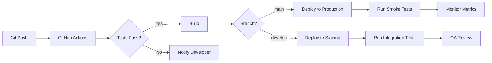

# HEUREKKA - Technical Architecture Blueprint
## Long-term Rental Marketplace System Architecture

---

## Executive Summary

### Architecture Overview
HEUREKKA is designed as a modern, scalable rental marketplace using a decoupled architecture with Next.js frontend, tRPC API layer, Supabase backend, and Redis-powered job processing. The system prioritizes mobile performance, real-time lead qualification, and seamless WhatsApp integration for the Honduras market.

### Technology Stack Summary
- **Frontend**: Next.js 14+ (App Router), TypeScript, TailwindCSS, shadcn/ui, Web Workers
- **API Layer**: tRPC with Next.js API routes, WebSocket connections
- **Backend**: Supabase (PostgreSQL + PostGIS), Edge Functions, Elasticsearch
- **Real-time**: WebSocket server with heartbeat/reconnection logic
- **Job Queue**: Redis + RQ on Railway with priority queues
- **Storage**: Supabase Storage with CDN, image transformation pipeline
- **Maps & Location**: Mapbox GL JS with clustering, Geocoding API
- **Messaging**: WhatsApp Business API with template system
- **Deployment**: Vercel (frontend) + Railway (workers) + Supabase Cloud

### System Component Overview
1. **Web Application**: Progressive Web App with offline capabilities and real-time updates
2. **API Gateway**: tRPC with WebSocket support for real-time communication
3. **Database Layer**: PostgreSQL with PostGIS + Elasticsearch for advanced search
4. **Authentication**: Supabase Auth with Magic Links + Google OAuth
5. **Real-time Infrastructure**: WebSocket server with auto-reconnection
6. **Job Processing**: Multi-priority Redis queues for async operations
7. **Image Pipeline**: Web Workers for client-side optimization + CDN transformations
8. **Storage**: Distributed file storage with multi-format support
9. **External Integrations**: WhatsApp Business API, Mapbox GL JS, Geocoding services
10. **Marketplace Engine**: Reverse marketplace with bidding system

### Critical Technical Constraints
- Mobile-first design (90% mobile traffic)
- 3G network optimization (<3s page load)
- WhatsApp API rate limits (1000 messages/day initially)
- Honduras internet infrastructure considerations
- Spanish/English localization requirements
- Real-time WebSocket connections with fallback mechanisms
- Image processing performance (bulk uploads up to 50 images)
- Elasticsearch cluster sizing for property search scale
- Map clustering performance for 10,000+ properties
- Message template approval process for WhatsApp Business

---

## System Architecture

### High-Level Architecture Diagram

```
┌─────────────────────────────────────────────────────────────┐
│                        CLIENT LAYER                         │
├─────────────────────────────────────────────────────────────┤
│  Next.js PWA │ Mobile Web │ Desktop Web │ WhatsApp Client  │
└──────┬───────────────────────────────────────────┬──────────┘
       │                                           │
       ▼                                           ▼
┌──────────────────────────────┐      ┌─────────────────────┐
│      API GATEWAY             │      │  EXTERNAL SERVICES  │
├──────────────────────────────┤      ├─────────────────────┤
│  tRPC Router                 │◄────►│  WhatsApp API       │
│  Next.js API Routes          │      │  Google Maps API    │
│  Rate Limiting               │      │  Google OAuth       │
│  Request Validation          │      │  SendGrid Email     │
└──────┬───────────────────────┘      └─────────────────────┘
       │
       ▼
┌──────────────────────────────────────────────────────────┐
│                    BUSINESS LOGIC LAYER                   │
├────────────────────────────────────────────────────────────┤
│  Auth Service │ Property Service │ Lead Service │ Search  │
│  User Service │ Messaging Service│ Analytics   │ Matching │
└──────┬────────────────────────────────────────────────────┘
       │
       ├────────────────┬──────────────────┐
       ▼                ▼                  ▼
┌──────────────┐ ┌──────────────┐ ┌──────────────┐
│  DATABASE    │ │   STORAGE    │ │  JOB QUEUE   │
├──────────────┤ ├──────────────┤ ├──────────────┤
│  PostgreSQL  │ │  Supabase    │ │  Redis + RQ  │
│  PostGIS     │ │  Storage     │ │  Workers     │
│  RLS Policies│ │  CDN         │ │  Railway     │
└──────────────┘ └──────────────┘ └──────────────┘
```

### Component Responsibilities

#### Frontend Application
- **Progressive Web App**: Service workers for offline browsing
- **State Management**: Zustand for UI state, TanStack Query for server state
- **Real-time Updates**: Supabase Realtime subscriptions for leads
- **Map Integration**: Lazy-loaded Mapbox/Google Maps components
- **Form Handling**: React Hook Form with Zod validation

#### API Gateway (tRPC)
- **Type Safety**: End-to-end TypeScript type sharing
- **Request Routing**: Organized procedure definitions
- **Authentication**: JWT verification middleware
- **Rate Limiting**: Per-user and per-IP limits
- **Error Handling**: Standardized error responses

#### Business Logic Services
- **Modular Services**: Separated by domain concerns
- **Transaction Management**: Database transaction handling
- **Business Rules**: Lead qualification, matching algorithms
- **Caching Strategy**: Redis for frequently accessed data

#### Data Persistence
- **PostgreSQL**: ACID compliance for critical data
- **PostGIS**: Efficient geospatial queries
- **Row Level Security**: User-based data isolation
- **Migrations**: Version-controlled schema changes

---

## Technology Stack Architecture

### Frontend Architecture

#### Framework and Core Libraries
```typescript
// Next.js 14+ App Router Configuration
- Framework: Next.js 14.2+
- Routing: App Router with parallel routes
- Rendering: SSR for SEO pages, CSR for interactive components
- Language: TypeScript 5.3+
- Styling: TailwindCSS 3.4+ with custom design system
- Components: shadcn/ui with custom theme
```

#### State Management Architecture
```typescript
// Client State (Zustand)
- UI State: Modals, filters, map viewport
- User Preferences: Saved searches, favorites
- Offline Queue: Pending actions for sync

// Server State (TanStack Query)
- Data Fetching: Properties, leads, user profiles
- Caching: 5-minute stale time for listings
- Optimistic Updates: Instant UI feedback
- Background Refetch: Keep data fresh
```

#### Performance Optimizations
- **Code Splitting**: Route-based with dynamic imports
- **Image Optimization**: Next/Image with blur placeholders
- **Bundle Size**: Tree shaking, component lazy loading
- **PWA Features**: Offline support, install prompt
- **Font Loading**: Variable fonts with font-display: swap

### Backend Architecture

#### API Design (tRPC)
```typescript
// Router Structure
appRouter
├── auth
│   ├── register
│   ├── login
│   └── logout
├── properties
│   ├── list
│   ├── get
│   ├── create
│   ├── update
│   └── delete
├── leads
│   ├── generate
│   ├── qualify
│   └── track
├── search
│   ├── properties
│   ├── profiles
│   └── suggestions
└── messaging
    ├── whatsapp
    └── notifications
```

#### Database Architecture (Supabase)
```sql
-- Core Schema Design
schemas
├── public (user-facing data)
├── auth (Supabase Auth)
├── storage (file metadata)
└── analytics (event tracking)

-- Extensions
- postgis (geospatial)
- pg_cron (scheduled jobs)
- uuid-ossp (UUID generation)
```

#### Background Job Architecture
```python
# Redis Queue Configuration
- Queue Priorities:
  - high: WhatsApp messages, lead notifications
  - normal: Email notifications, image processing
  - low: Analytics, cleanup tasks

# Worker Processes
- Lead Processor: Qualification and matching
- Image Processor: Resize, optimize, generate thumbnails
- Notification Worker: Email and WhatsApp delivery
- Analytics Worker: Event aggregation
```

### Infrastructure Architecture

#### Development Environment
```yaml
# Docker Compose Services
services:
  frontend:
    - Next.js with hot reload
    - Port: 3000
  
  supabase:
    - Local Supabase instance
    - PostgreSQL + PostGIS
    - Port: 54321
  
  redis:
    - Redis for queues/cache
    - Port: 6379
  
  elasticsearch:
    - Single-node ES cluster
    - Port: 9200
  
  websocket:
    - WebSocket server (Node.js)
    - Port: 3001
  
  worker:
    - Python RQ workers
    - Auto-reload on changes
  
  mapbox:
    - Local tile server (optional)
    - Port: 8080
```

#### Production Deployment
```yaml
# Multi-Service Infrastructure
vercel:
  - Next.js frontend
  - Edge functions
  - Global CDN
  - Web Workers support

railway:
  - Redis cluster (3 nodes)
  - Python workers (auto-scaling)
  - WebSocket server
  - Monitoring dashboard

supabase:
  - Managed PostgreSQL with PostGIS
  - Realtime subscriptions
  - Storage with CDN
  - Edge Functions

elasticsearch_cloud:
  - 3-node cluster
  - Auto-scaling
  - Spanish language analyzer

cloudinary:
  - Image CDN
  - On-the-fly transformations
  - Auto-format delivery

whatsapp_cloud:
  - Business API
  - Template management
  - Webhook endpoints

mapbox:
  - Vector tiles API
  - Geocoding service
  - Static maps API
```

---

## Advanced Technical Infrastructure

### Real-time Communication System

#### WebSocket Infrastructure
```typescript
// WebSocket Server Configuration
interface WebSocketConfig {
  server: {
    port: 3001;
    path: '/ws';
    perMessageDeflate: true;
    maxPayload: 100 * 1024; // 100KB
  };
  
  heartbeat: {
    interval: 30000; // 30 seconds
    timeout: 60000; // 60 seconds
    reconnectDelay: [1000, 2000, 5000, 10000]; // Exponential backoff
  };
  
  channels: {
    leads: 'leads:*';
    properties: 'properties:*';
    messages: 'messages:*';
    notifications: 'notifications:*';
  };
}

// Client-side WebSocket Manager
class WebSocketManager {
  private ws: WebSocket | null = null;
  private reconnectTimer: NodeJS.Timeout | null = null;
  private heartbeatTimer: NodeJS.Timeout | null = null;
  private messageQueue: Message[] = [];
  
  connect(): void {
    this.ws = new WebSocket('wss://api.heurekka.com/ws');
    this.setupEventHandlers();
    this.startHeartbeat();
  }
  
  private handleReconnection(): void {
    // Exponential backoff with jitter
    const delay = this.getReconnectDelay();
    this.reconnectTimer = setTimeout(() => {
      this.connect();
    }, delay);
  }
}
```

#### Real-time Features Implementation
```typescript
// Auto-save functionality for forms
interface AutoSaveConfig {
  debounceMs: 2000; // 2 seconds
  maxRetries: 3;
  storageKey: 'form_autosave';
  
  fields: {
    onChange: string[]; // Fields that trigger immediate save
    onBlur: string[]; // Fields that save on blur
    periodic: number; // Periodic save interval (ms)
  };
}

// Live search updates
interface LiveSearchConfig {
  minQueryLength: 3;
  debounceMs: 500;
  maxResults: 50;
  
  subscriptions: {
    newListings: boolean;
    priceChanges: boolean;
    availability: boolean;
  };
}
```

### Advanced Search Infrastructure

#### Elasticsearch Integration
```yaml
# Elasticsearch Configuration
elasticsearch:
  cluster:
    nodes: 3
    replicas: 2
    shards: 5
  
  indices:
    properties:
      mappings:
        - title: text with spanish analyzer
        - description: text with spanish analyzer
        - location: geo_point
        - amenities: keyword
        - price: scaled_float
        - bedrooms: short
        - bathrooms: half_float
        - area_sqm: integer
        - neighborhood: keyword with ngram
      
    tenant_profiles:
      mappings:
        - search_criteria: nested
        - budget_range: integer_range
        - preferred_locations: geo_shape
        - move_date: date_range
```

#### Search Service Architecture
```typescript
// Elasticsearch Service
class PropertySearchService {
  private client: Client;
  
  async searchProperties(criteria: SearchCriteria): Promise<SearchResults> {
    const query = {
      bool: {
        must: [
          // Geospatial query
          {
            geo_distance: {
              distance: `${criteria.radiusKm}km`,
              location: criteria.centerPoint
            }
          },
          // Price range
          {
            range: {
              price: {
                gte: criteria.budget.min,
                lte: criteria.budget.max
              }
            }
          }
        ],
        should: [
          // Boost for matching amenities
          {
            terms: {
              amenities: criteria.desiredAmenities,
              boost: 2.0
            }
          }
        ],
        filter: [
          // Hard filters
          { term: { available: true } },
          { range: { bedrooms: { gte: criteria.minBedrooms } } }
        ]
      }
    };
    
    return await this.client.search({
      index: 'properties',
      body: { query },
      size: 100,
      from: criteria.offset || 0
    });
  }
}
```

### Map and Location Services

#### Mapbox GL JS Integration
```typescript
// Map Configuration
interface MapConfig {
  style: 'mapbox://styles/heurekka/custom-honduras';
  center: [-87.2068, 14.0723]; // Tegucigalpa
  zoom: 12;
  minZoom: 10;
  maxZoom: 18;
  
  clustering: {
    enabled: true;
    radius: 50;
    maxZoom: 14;
    properties: {
      sum: ['properties_count'],
      avg: ['price']
    };
  };
  
  controls: {
    navigation: true;
    geolocate: true;
    scale: true;
    draw: true; // For search area drawing
  };
}

// Property Clustering Algorithm
class PropertyClusterManager {
  private map: mapboxgl.Map;
  private supercluster: Supercluster;
  
  initializeClustering(properties: Property[]): void {
    this.supercluster = new Supercluster({
      radius: 40,
      maxZoom: 16,
      map: (props) => ({
        count: 1,
        avgPrice: props.price,
        propertyType: props.type
      }),
      reduce: (accumulated, props) => {
        accumulated.count += 1;
        accumulated.avgPrice = 
          (accumulated.avgPrice * (accumulated.count - 1) + props.avgPrice) / 
          accumulated.count;
      }
    });
    
    const points = properties.map(p => ({
      type: 'Feature',
      properties: p,
      geometry: {
        type: 'Point',
        coordinates: [p.longitude, p.latitude]
      }
    }));
    
    this.supercluster.load(points);
  }
}
```

#### Geocoding Service
```typescript
// Address Validation and Geocoding
interface GeocodingService {
  providers: {
    primary: 'mapbox';
    fallback: 'nominatim';
  };
  
  cache: {
    ttl: 86400; // 24 hours
    maxSize: 10000; // entries
  };
  
  validation: {
    honduras: {
      departments: string[];
      municipalities: string[];
      postalCodePattern: RegExp;
    };
  };
}

class AddressValidator {
  async validateAndGeocode(address: AddressInput): Promise<GeocodedAddress> {
    // Check cache first
    const cached = await this.cache.get(address.formatted);
    if (cached) return cached;
    
    // Validate Honduras-specific format
    if (!this.isValidHondurasAddress(address)) {
      throw new ValidationError('Invalid Honduras address format');
    }
    
    // Geocode with fallback
    try {
      const result = await this.mapboxGeocode(address);
      await this.cache.set(address.formatted, result);
      return result;
    } catch (error) {
      return await this.nominatimGeocode(address);
    }
  }
}
```

### Image Processing Pipeline

#### Client-side Processing with Web Workers
```javascript
// Web Worker for Image Processing
// /public/workers/imageProcessor.js
self.addEventListener('message', async (e) => {
  const { action, payload } = e.data;
  
  switch (action) {
    case 'optimize':
      const optimized = await optimizeImage(payload);
      self.postMessage({ action: 'optimized', result: optimized });
      break;
      
    case 'bulk_resize':
      const resized = await bulkResize(payload);
      self.postMessage({ action: 'resized', result: resized });
      break;
      
    case 'generate_thumbnails':
      const thumbnails = await generateThumbnails(payload);
      self.postMessage({ action: 'thumbnails', result: thumbnails });
      break;
  }
});

async function optimizeImage(file) {
  const bitmap = await createImageBitmap(file);
  const canvas = new OffscreenCanvas(bitmap.width, bitmap.height);
  const ctx = canvas.getContext('2d');
  
  // Apply optimizations
  ctx.drawImage(bitmap, 0, 0);
  
  // Convert to optimal format
  const blob = await canvas.convertToBlob({
    type: 'image/webp',
    quality: 0.85
  });
  
  return {
    original: file,
    optimized: blob,
    reduction: ((file.size - blob.size) / file.size * 100).toFixed(2)
  };
}
```

#### Server-side CDN Integration
```typescript
// CDN Image Transformation Service
interface CDNImageConfig {
  provider: 'cloudinary' | 'imagekit';
  
  transformations: {
    listing_hero: {
      width: 1200;
      height: 800;
      quality: 'auto:good';
      format: 'auto';
      crop: 'fill';
    };
    listing_thumbnail: {
      width: 400;
      height: 300;
      quality: 'auto:eco';
      format: 'auto';
      crop: 'fill';
    };
    listing_gallery: {
      width: 800;
      height: 600;
      quality: 'auto:good';
      format: 'auto';
      watermark: true;
    };
  };
  
  upload: {
    maxFileSize: 10 * 1024 * 1024; // 10MB
    allowedFormats: ['jpg', 'jpeg', 'png', 'webp', 'heic'];
    bulkLimit: 50; // Max files per upload
  };
}

class ImagePipeline {
  async processBulkUpload(files: File[]): Promise<ProcessedImage[]> {
    // Client-side validation
    const validated = await this.validateFiles(files);
    
    // Process in Web Worker
    const optimized = await this.worker.process(validated);
    
    // Upload to CDN with progress tracking
    const uploaded = await this.uploadWithProgress(optimized);
    
    // Generate all transformation URLs
    return uploaded.map(img => ({
      id: img.public_id,
      original: img.secure_url,
      hero: this.getTransformUrl(img, 'listing_hero'),
      thumbnail: this.getTransformUrl(img, 'listing_thumbnail'),
      gallery: this.getTransformUrl(img, 'listing_gallery')
    }));
  }
}
```

### WhatsApp Business API Integration

#### Message Template System
```typescript
// WhatsApp Template Management
interface WhatsAppTemplates {
  lead_notification: {
    name: 'lead_notification_v2';
    language: 'es_MX';
    components: [
      {
        type: 'header';
        format: 'text';
        text: 'Nueva consulta de inquilino';
      },
      {
        type: 'body';
        text: 'Hola {{1}}, tienes una nueva consulta para tu propiedad {{2}}.\n\nInquilino: {{3}}\nPresupuesto: L{{4}}-L{{5}}\nFecha de mudanza: {{6}}\n\nMensaje: {{7}}';
      },
      {
        type: 'footer';
        text: 'HEUREKKA - Tu marketplace de alquileres';
      },
      {
        type: 'buttons';
        buttons: [
          {
            type: 'quick_reply';
            text: 'Ver detalles';
          },
          {
            type: 'quick_reply';
            text: 'Responder';
          }
        ];
      }
    ];
  };
  
  viewing_reminder: {
    name: 'viewing_reminder_v1';
    language: 'es_MX';
    // ... template structure
  };
}

// WhatsApp Service Implementation
class WhatsAppService {
  private client: WhatsAppBusinessAPI;
  private templates: Map<string, Template>;
  
  async sendTemplateMessage(params: {
    to: string;
    template: keyof WhatsAppTemplates;
    variables: Record<string, string>;
  }): Promise<MessageResponse> {
    // Phone number validation for Honduras
    const validatedPhone = this.validateHondurasPhone(params.to);
    
    // Get approved template
    const template = this.templates.get(params.template);
    if (!template || template.status !== 'APPROVED') {
      throw new Error(`Template ${params.template} not available`);
    }
    
    // Build message with variables
    const message = this.buildTemplateMessage(template, params.variables);
    
    // Send with retry logic
    return await this.sendWithRetry(validatedPhone, message);
  }
  
  private validateHondurasPhone(phone: string): string {
    // Honduras phone format: +504 XXXX-XXXX
    const cleaned = phone.replace(/\D/g, '');
    if (!cleaned.startsWith('504') || cleaned.length !== 11) {
      throw new ValidationError('Invalid Honduras phone number');
    }
    return `+${cleaned}`;
  }
}
```

#### Deep Linking Integration
```typescript
// WhatsApp Deep Link Generator
class WhatsAppDeepLinkService {
  generatePropertyInquiryLink(params: {
    property: Property;
    tenant: TenantProfile;
    landlordPhone: string;
  }): string {
    const message = this.buildInquiryMessage(params);
    const encodedMessage = encodeURIComponent(message);
    const phone = this.formatPhoneForWhatsApp(params.landlordPhone);
    
    return `https://wa.me/${phone}?text=${encodedMessage}`;
  }
  
  private buildInquiryMessage(params: any): string {
    return `¡Hola! Me interesa su propiedad ${params.property.title} publicada en HEUREKKA.

📍 ${params.property.address}
💰 Precio: L${params.property.price}/mes
🏠 ${params.property.bedrooms} habitaciones, ${params.property.bathrooms} baños

Mi información:
👤 Nombre: ${params.tenant.name}
💼 Ocupación: ${params.tenant.employment}
👥 Ocupantes: ${params.tenant.occupants}
📅 Fecha de mudanza: ${params.tenant.moveDate}
💵 Presupuesto: L${params.tenant.budgetMin}-L${params.tenant.budgetMax}

¿Podríamos coordinar una visita?

Ref: ${params.property.id}`;
  }
}
```

### Advanced Form Management

#### Multi-step Wizard State Management
```typescript
// Form Wizard State Machine
interface WizardStateMachine {
  states: {
    initial: 'step1';
    step1: { next: 'step2'; prev: null; };
    step2: { next: 'step3'; prev: 'step1'; };
    step3: { next: 'review'; prev: 'step2'; };
    review: { next: 'submit'; prev: 'step3'; };
    submit: { next: 'complete'; prev: 'review'; };
    complete: { next: null; prev: null; };
  };
  
  persistence: {
    strategy: 'localStorage' | 'sessionStorage' | 'indexedDB';
    key: 'wizard_state';
    ttl: 3600000; // 1 hour
  };
}

class FormWizardManager {
  private state: WizardState;
  private history: WizardStep[];
  
  async saveProgress(): Promise<void> {
    const data = {
      currentStep: this.state.current,
      formData: this.state.data,
      timestamp: Date.now(),
      sessionId: this.state.sessionId
    };
    
    // Save to IndexedDB for large forms
    await this.db.wizardState.put(data);
    
    // Sync to server for recovery
    await this.api.saveFormProgress(data);
  }
  
  async restoreProgress(sessionId: string): Promise<WizardState | null> {
    // Try local storage first
    const local = await this.db.wizardState.get(sessionId);
    if (local && Date.now() - local.timestamp < this.config.persistence.ttl) {
      return local;
    }
    
    // Fallback to server
    return await this.api.getFormProgress(sessionId);
  }
}
```

#### Complex Validation Schemas
```typescript
// Advanced Form Validation with Zod
const PropertyListingSchema = z.object({
  basic: z.object({
    title: z.string()
      .min(10, 'El título debe tener al menos 10 caracteres')
      .max(100, 'El título no puede exceder 100 caracteres')
      .refine(
        (val) => !containsProfanity(val),
        'El título contiene lenguaje inapropiado'
      ),
    
    propertyType: z.enum(['house', 'apartment', 'condo', 'room']),
    
    price: z.number()
      .min(3000, 'El precio mínimo es L3,000')
      .max(100000, 'El precio máximo es L100,000')
      .refine(
        (val) => val % 100 === 0,
        'El precio debe ser múltiplo de 100'
      )
  }),
  
  location: z.object({
    address: z.string()
      .refine(
        async (val) => await validateHondurasAddress(val),
        'Dirección inválida o no encontrada'
      ),
    
    coordinates: z.object({
      lat: z.number().min(-90).max(90),
      lng: z.number().min(-180).max(180)
    }).optional(),
    
    neighborhood: z.string(),
    city: z.string(),
    department: z.enum(HONDURAS_DEPARTMENTS)
  }),
  
  features: z.object({
    bedrooms: z.number().int().min(0).max(10),
    bathrooms: z.number().min(0.5).max(10).multipleOf(0.5),
    area: z.number().min(20).max(1000),
    parking: z.number().int().min(0).max(10),
    
    amenities: z.array(z.enum(AVAILABLE_AMENITIES))
      .min(1, 'Selecciona al menos una amenidad')
      .max(20, 'Máximo 20 amenidades')
  }),
  
  media: z.object({
    images: z.array(
      z.object({
        url: z.string().url(),
        caption: z.string().max(200).optional(),
        order: z.number().int().min(0)
      })
    )
    .min(3, 'Mínimo 3 imágenes requeridas')
    .max(50, 'Máximo 50 imágenes permitidas')
    .refine(
      (images) => images.some(img => img.order === 0),
      'Debe seleccionar una imagen principal'
    ),
    
    virtualTourUrl: z.string().url().optional(),
    videoUrl: z.string().url().optional()
  })
}).refine(
  async (data) => {
    // Cross-field validation
    if (data.features.bedrooms === 0 && data.basic.propertyType !== 'room') {
      return false;
    }
    return true;
  },
  {
    message: 'Configuración de habitaciones inválida para el tipo de propiedad',
    path: ['features', 'bedrooms']
  }
);
```

### Reverse Marketplace Database Schema

#### Tenant Marketplace Tables
```sql
-- Reverse marketplace core tables
CREATE TABLE public.tenant_posts (
  id UUID PRIMARY KEY DEFAULT uuid_generate_v4(),
  user_id UUID REFERENCES public.profiles(id) ON DELETE CASCADE,
  status VARCHAR(20) DEFAULT 'draft' CHECK (status IN ('draft', 'active', 'paused', 'fulfilled', 'expired')),
  
  -- Budget and preferences
  budget_min DECIMAL(10,2) NOT NULL CHECK (budget_min >= 3000),
  budget_max DECIMAL(10,2) NOT NULL CHECK (budget_max <= 100000),
  move_in_date DATE NOT NULL,
  date_flexibility VARCHAR(20),
  lease_duration INTEGER DEFAULT 12,
  urgency VARCHAR(20),
  
  -- Property requirements
  property_types TEXT[],
  bedrooms_min INTEGER NOT NULL,
  bedrooms_max INTEGER,
  bathrooms_min DECIMAL(2,1) NOT NULL,
  parking_spaces INTEGER DEFAULT 0,
  
  -- Location preferences with PostGIS
  preferred_locations GEOGRAPHY(MULTIPOLYGON, 4326),
  search_radius_km INTEGER DEFAULT 5,
  neighborhoods TEXT[],
  must_be_near JSONB, -- Schools, work, etc.
  
  -- Tenant information
  occupants INTEGER NOT NULL,
  pets JSONB,
  employment_type VARCHAR(50),
  employer VARCHAR(200),
  income_proof BOOLEAN DEFAULT FALSE,
  guarantor_available BOOLEAN DEFAULT FALSE,
  
  -- Post details
  title VARCHAR(200) NOT NULL,
  description TEXT,
  requirements TEXT,
  
  -- Matching and visibility
  match_score_threshold INTEGER DEFAULT 70,
  auto_match BOOLEAN DEFAULT TRUE,
  visibility VARCHAR(20) DEFAULT 'all',
  
  -- Analytics
  view_count INTEGER DEFAULT 0,
  response_count INTEGER DEFAULT 0,
  last_viewed_at TIMESTAMP,
  
  -- Timestamps
  created_at TIMESTAMP DEFAULT NOW(),
  updated_at TIMESTAMP DEFAULT NOW(),
  expires_at TIMESTAMP,
  
  -- Constraints
  CONSTRAINT budget_check CHECK (budget_max >= budget_min),
  CONSTRAINT bedrooms_check CHECK (bedrooms_max IS NULL OR bedrooms_max >= bedrooms_min)
);

-- Landlord responses/proposals
CREATE TABLE public.landlord_responses (
  id UUID PRIMARY KEY DEFAULT uuid_generate_v4(),
  tenant_post_id UUID REFERENCES public.tenant_posts(id) ON DELETE CASCADE,
  landlord_id UUID REFERENCES public.landlord_profiles(id) ON DELETE CASCADE,
  property_id UUID REFERENCES public.properties(id) ON DELETE SET NULL,
  
  -- Response type
  response_type VARCHAR(20) CHECK (response_type IN ('proposal', 'invitation', 'match')),
  status VARCHAR(20) DEFAULT 'pending',
  
  -- Proposal details
  proposed_rent DECIMAL(10,2),
  negotiable BOOLEAN DEFAULT FALSE,
  available_date DATE,
  lease_terms JSONB,
  
  -- Custom message
  message TEXT,
  attachments JSONB,
  
  -- Interaction tracking
  viewed_by_tenant BOOLEAN DEFAULT FALSE,
  viewed_at TIMESTAMP,
  response_time_hours INTEGER,
  
  -- Timestamps
  created_at TIMESTAMP DEFAULT NOW(),
  updated_at TIMESTAMP DEFAULT NOW(),
  
  -- Prevent duplicate responses
  UNIQUE(tenant_post_id, landlord_id, property_id)
);

-- Matching scores and algorithms
CREATE TABLE public.tenant_post_matches (
  id UUID PRIMARY KEY DEFAULT uuid_generate_v4(),
  tenant_post_id UUID REFERENCES public.tenant_posts(id) ON DELETE CASCADE,
  property_id UUID REFERENCES public.properties(id) ON DELETE CASCADE,
  
  -- Matching scores (0-100)
  overall_score INTEGER NOT NULL,
  location_score INTEGER,
  budget_score INTEGER,
  amenities_score INTEGER,
  availability_score INTEGER,
  
  -- Match metadata
  match_reasons JSONB,
  missing_requirements TEXT[],
  
  -- Status
  status VARCHAR(20) DEFAULT 'potential',
  landlord_notified BOOLEAN DEFAULT FALSE,
  tenant_interested BOOLEAN,
  
  created_at TIMESTAMP DEFAULT NOW(),
  
  UNIQUE(tenant_post_id, property_id)
);

-- Create indexes for performance
CREATE INDEX idx_tenant_posts_status ON tenant_posts(status) WHERE status = 'active';
CREATE INDEX idx_tenant_posts_budget ON tenant_posts(budget_min, budget_max);
CREATE INDEX idx_tenant_posts_move_date ON tenant_posts(move_in_date);
CREATE INDEX idx_tenant_posts_location ON tenant_posts USING GIST(preferred_locations);
CREATE INDEX idx_landlord_responses_tenant ON landlord_responses(tenant_post_id);
CREATE INDEX idx_landlord_responses_landlord ON landlord_responses(landlord_id);
CREATE INDEX idx_matches_scores ON tenant_post_matches(overall_score DESC);
```

#### Matching Algorithm Implementation
```typescript
// Advanced Matching Algorithm
class TenantPropertyMatcher {
  async calculateMatch(
    tenantPost: TenantPost,
    property: Property
  ): Promise<MatchScore> {
    const scores = {
      location: this.calculateLocationScore(tenantPost, property),
      budget: this.calculateBudgetScore(tenantPost, property),
      features: this.calculateFeaturesScore(tenantPost, property),
      availability: this.calculateAvailabilityScore(tenantPost, property),
      amenities: this.calculateAmenitiesScore(tenantPost, property)
    };
    
    // Weighted average with configurable weights
    const weights = {
      location: 0.30,
      budget: 0.25,
      features: 0.20,
      availability: 0.15,
      amenities: 0.10
    };
    
    const overall = Object.entries(scores).reduce(
      (sum, [key, score]) => sum + score * weights[key],
      0
    );
    
    return {
      overall: Math.round(overall),
      breakdown: scores,
      reasons: this.generateMatchReasons(scores),
      missingRequirements: this.findMissingRequirements(tenantPost, property)
    };
  }
  
  private calculateLocationScore(
    tenantPost: TenantPost,
    property: Property
  ): number {
    // Check if property is within preferred areas
    if (tenantPost.preferredLocations) {
      const isWithinArea = this.isPointInMultiPolygon(
        property.coordinates,
        tenantPost.preferredLocations
      );
      if (isWithinArea) return 100;
    }
    
    // Calculate distance-based score
    const distance = this.calculateDistance(
      tenantPost.searchCenter,
      property.coordinates
    );
    
    if (distance <= tenantPost.searchRadiusKm) {
      return 100 - (distance / tenantPost.searchRadiusKm * 50);
    }
    
    return 0;
  }
}
```

---

## Component Design and Relationships

### Core System Components

#### 1. User Management Component
```typescript
interface UserComponent {
  services: {
    authentication: AuthService;
    profile: ProfileService;
    preferences: PreferencesService;
  };
  
  models: {
    User: BaseUser;
    TenantProfile: SearchProfile;
    LandlordProfile: PropertyOwner;
  };
  
  repositories: {
    userRepo: SupabaseRepository<User>;
    profileRepo: SupabaseRepository<Profile>;
  };
}
```

#### 2. Property Management Component
```typescript
interface PropertyComponent {
  services: {
    listing: ListingService;
    search: SearchService;
    geocoding: GeocodingService;
  };
  
  models: {
    Property: PropertyListing;
    Location: GeoLocation;
    Amenities: PropertyAmenities;
  };
  
  repositories: {
    propertyRepo: PropertyRepository;
    geoRepo: PostGISRepository;
  };
}
```

#### 3. Lead Management Component
```typescript
interface LeadComponent {
  services: {
    generation: LeadGenerationService;
    qualification: QualificationService;
    tracking: LeadTrackingService;
  };
  
  models: {
    Lead: QualifiedLead;
    Conversation: LeadConversation;
    Status: LeadStatus;
  };
  
  repositories: {
    leadRepo: LeadRepository;
    conversationRepo: ConversationRepository;
  };
}
```

#### 4. Messaging Component
```typescript
interface MessagingComponent {
  services: {
    whatsapp: WhatsAppService;
    notification: NotificationService;
    template: TemplateService;
  };
  
  models: {
    Message: BaseMessage;
    Template: MessageTemplate;
    Queue: MessageQueue;
  };
  
  integrations: {
    whatsappAPI: WhatsAppBusinessAPI;
    sendgrid: EmailService;
  };
}
```

### Component Interaction Patterns

#### Service Layer Communication
```typescript
// Cross-Service Communication via Events
EventBus
├── property.created → notification.send
├── lead.qualified → whatsapp.notify
├── user.registered → email.welcome
└── search.saved → matching.process
```

#### Data Flow Architecture
```typescript
// Request Flow
Client Request
  → tRPC Procedure
    → Validation (Zod)
      → Authentication Check
        → Business Logic Service
          → Database/Cache Query
            → Response Transformation
              → Client Response
```

---

## API Contracts and Endpoints

### Authentication Endpoints

#### Register User
```typescript
// POST /api/trpc/auth.register
interface RegisterInput {
  email: string;
  password?: string; // Optional for magic link
  userType: 'tenant' | 'landlord';
  profile: {
    firstName: string;
    lastName: string;
    phone: string; // +504 format
    preferredLanguage: 'es' | 'en';
  };
}

interface RegisterOutput {
  user: {
    id: string;
    email: string;
    profile: UserProfile;
  };
  session: {
    accessToken: string;
    refreshToken: string;
    expiresAt: number;
  };
}
```

#### Login
```typescript
// POST /api/trpc/auth.login
interface LoginInput {
  method: 'magic-link' | 'google' | 'password';
  email?: string;
  password?: string;
  googleToken?: string;
}

interface LoginOutput {
  user: User;
  session: Session;
  requiresProfileCompletion: boolean;
}
```

### Property Endpoints

#### List Properties
```typescript
// GET /api/trpc/properties.list
interface ListPropertiesInput {
  filters: {
    priceMin?: number;
    priceMax?: number;
    bedrooms?: number[];
    bathrooms?: number[];
    propertyType?: PropertyType[];
    amenities?: string[];
    location?: {
      lat: number;
      lng: number;
      radiusKm: number;
    };
    neighborhoods?: string[];
  };
  pagination: {
    page: number;
    limit: number; // Max 50
  };
  sort?: {
    field: 'price' | 'createdAt' | 'distance';
    order: 'asc' | 'desc';
  };
}

interface ListPropertiesOutput {
  properties: Property[];
  totalCount: number;
  hasMore: boolean;
  aggregations: {
    priceRange: { min: number; max: number };
    availableAmenities: string[];
  };
}
```

#### Create Property
```typescript
// POST /api/trpc/properties.create
interface CreatePropertyInput {
  basic: {
    title: string;
    description: string; // Min 50, max 2000 chars
    propertyType: 'apartment' | 'house' | 'room';
    price: number; // L.3000 - L.100000
    currency: 'HNL';
  };
  details: {
    bedrooms: number;
    bathrooms: number;
    area?: number; // Square meters
    floor?: number;
    totalFloors?: number;
    yearBuilt?: number;
    parkingSpaces?: number;
  };
  location: {
    address: string;
    neighborhood: string;
    city: string;
    coordinates?: {
      lat: number;
      lng: number;
    };
  };
  amenities: string[];
  availability: {
    availableFrom: Date;
    minimumStay?: number; // Months
    petsAllowed?: boolean;
  };
  images: {
    url: string;
    order: number;
    caption?: string;
  }[];
}

interface CreatePropertyOutput {
  property: Property;
  status: 'draft' | 'pending_review' | 'active';
  listingUrl: string;
}
```

### Lead Management Endpoints

#### Generate Lead
```typescript
// POST /api/trpc/leads.generate
interface GenerateLeadInput {
  propertyId: string;
  tenantProfile: {
    budget: {
      min: number;
      max: number;
    };
    moveDate: Date;
    occupants: number;
    employment: string;
    requirements?: string;
  };
  contactMethod: 'whatsapp' | 'platform';
  message?: string;
}

interface GenerateLeadOutput {
  lead: {
    id: string;
    status: 'new';
    qualificationScore: number; // 0-100
    propertyMatch: boolean;
  };
  whatsappUrl?: string; // Pre-filled WhatsApp link
  landlordNotified: boolean;
}
```

#### Track Lead Status
```typescript
// PUT /api/trpc/leads.updateStatus
interface UpdateLeadStatusInput {
  leadId: string;
  status: 'new' | 'contacted' | 'viewing_scheduled' | 'application' | 'closed';
  notes?: string;
  nextAction?: {
    type: 'follow_up' | 'viewing' | 'documents';
    scheduledFor?: Date;
  };
}

interface UpdateLeadStatusOutput {
  lead: Lead;
  timeline: LeadEvent[];
  notifications: {
    tenant: boolean;
    landlord: boolean;
  };
}
```

### Search Profile Endpoints

#### Create Search Profile
```typescript
// POST /api/trpc/searchProfiles.create
interface CreateSearchProfileInput {
  budget: {
    min: number;
    max: number;
  };
  preferences: {
    propertyTypes: PropertyType[];
    bedrooms: { min: number; max?: number };
    bathrooms: { min: number; max?: number };
    neighborhoods: string[];
    mustHave: string[]; // Required amenities
    niceToHave: string[]; // Optional amenities
  };
  timeline: {
    moveDate: Date;
    urgency: 'immediate' | 'flexible' | 'planning';
  };
  about: {
    occupants: number;
    pets?: { type: string; count: number };
    employment: string;
    guarantor?: boolean;
  };
}

interface CreateSearchProfileOutput {
  profile: SearchProfile;
  matchingProperties: number;
  savedSearchId: string;
}
```

### Messaging Endpoints

#### Send WhatsApp Message
```typescript
// POST /api/trpc/messaging.sendWhatsApp
interface SendWhatsAppInput {
  recipient: {
    phone: string; // +504 format
    name: string;
  };
  template: 'lead_notification' | 'viewing_reminder' | 'custom';
  variables?: Record<string, string>;
  customMessage?: string;
}

interface SendWhatsAppOutput {
  messageId: string;
  status: 'queued' | 'sent' | 'failed';
  deliveryTime?: Date;
  error?: string;
}
```

---

## Data Models and Database Schema

### Core Database Schema

#### Users and Authentication
```sql
-- users table (managed by Supabase Auth)
CREATE TABLE auth.users (
  id UUID PRIMARY KEY DEFAULT uuid_generate_v4(),
  email VARCHAR(255) UNIQUE NOT NULL,
  encrypted_password VARCHAR(255),
  email_confirmed_at TIMESTAMP,
  created_at TIMESTAMP DEFAULT NOW(),
  updated_at TIMESTAMP DEFAULT NOW()
);

-- profiles table
CREATE TABLE public.profiles (
  id UUID PRIMARY KEY REFERENCES auth.users(id) ON DELETE CASCADE,
  user_type VARCHAR(20) NOT NULL CHECK (user_type IN ('tenant', 'landlord', 'both')),
  first_name VARCHAR(100) NOT NULL,
  last_name VARCHAR(100) NOT NULL,
  phone VARCHAR(20) UNIQUE,
  phone_verified BOOLEAN DEFAULT FALSE,
  preferred_language VARCHAR(2) DEFAULT 'es',
  avatar_url TEXT,
  created_at TIMESTAMP DEFAULT NOW(),
  updated_at TIMESTAMP DEFAULT NOW()
);

-- tenant_profiles table
CREATE TABLE public.tenant_profiles (
  id UUID PRIMARY KEY DEFAULT uuid_generate_v4(),
  user_id UUID NOT NULL REFERENCES public.profiles(id) ON DELETE CASCADE,
  budget_min DECIMAL(10,2) NOT NULL CHECK (budget_min >= 3000),
  budget_max DECIMAL(10,2) NOT NULL CHECK (budget_max <= 100000),
  move_date DATE NOT NULL,
  occupants INTEGER NOT NULL DEFAULT 1,
  has_pets BOOLEAN DEFAULT FALSE,
  pet_details JSONB,
  employment_type VARCHAR(50),
  employer VARCHAR(200),
  has_guarantor BOOLEAN DEFAULT FALSE,
  preferred_neighborhoods TEXT[],
  search_radius_km INTEGER DEFAULT 5,
  requirements TEXT,
  is_active BOOLEAN DEFAULT TRUE,
  created_at TIMESTAMP DEFAULT NOW(),
  updated_at TIMESTAMP DEFAULT NOW(),
  CONSTRAINT budget_check CHECK (budget_max >= budget_min)
);

-- landlord_profiles table
CREATE TABLE public.landlord_profiles (
  id UUID PRIMARY KEY DEFAULT uuid_generate_v4(),
  user_id UUID NOT NULL REFERENCES public.profiles(id) ON DELETE CASCADE,
  company_name VARCHAR(200),
  business_type VARCHAR(50) CHECK (business_type IN ('individual', 'agency', 'developer')),
  verification_status VARCHAR(20) DEFAULT 'pending',
  verification_documents JSONB,
  response_time_minutes INTEGER,
  total_properties INTEGER DEFAULT 0,
  active_properties INTEGER DEFAULT 0,
  rating DECIMAL(3,2),
  rating_count INTEGER DEFAULT 0,
  created_at TIMESTAMP DEFAULT NOW(),
  updated_at TIMESTAMP DEFAULT NOW()
);
```

#### Properties and Listings
```sql
-- properties table
CREATE TABLE public.properties (
  id UUID PRIMARY KEY DEFAULT uuid_generate_v4(),
  landlord_id UUID NOT NULL REFERENCES public.landlord_profiles(id),
  title VARCHAR(200) NOT NULL,
  slug VARCHAR(250) UNIQUE NOT NULL,
  description TEXT NOT NULL CHECK (LENGTH(description) >= 50),
  property_type VARCHAR(20) NOT NULL CHECK (property_type IN ('apartment', 'house', 'room', 'office')),
  status VARCHAR(20) DEFAULT 'draft' CHECK (status IN ('draft', 'active', 'paused', 'rented')),
  
  -- Pricing
  price DECIMAL(10,2) NOT NULL CHECK (price BETWEEN 3000 AND 100000),
  currency VARCHAR(3) DEFAULT 'HNL',
  utilities_included BOOLEAN DEFAULT FALSE,
  
  -- Details
  bedrooms INTEGER NOT NULL,
  bathrooms DECIMAL(3,1) NOT NULL,
  area_sqm INTEGER,
  floor INTEGER,
  total_floors INTEGER,
  year_built INTEGER,
  parking_spaces INTEGER DEFAULT 0,
  
  -- Availability
  available_from DATE NOT NULL,
  minimum_stay_months INTEGER DEFAULT 12,
  maximum_occupants INTEGER,
  pets_allowed BOOLEAN DEFAULT FALSE,
  pet_restrictions TEXT,
  
  -- Metadata
  view_count INTEGER DEFAULT 0,
  contact_count INTEGER DEFAULT 0,
  favorite_count INTEGER DEFAULT 0,
  last_updated TIMESTAMP DEFAULT NOW(),
  created_at TIMESTAMP DEFAULT NOW(),
  
  -- SEO
  meta_description TEXT,
  
  -- Indexing
  search_vector tsvector,
  
  CONSTRAINT valid_price CHECK (price > 0),
  CONSTRAINT valid_bedrooms CHECK (bedrooms >= 0),
  CONSTRAINT valid_bathrooms CHECK (bathrooms >= 0)
);

-- Create search vector trigger
CREATE TRIGGER update_property_search_vector
BEFORE INSERT OR UPDATE ON properties
FOR EACH ROW
EXECUTE FUNCTION tsvector_update_trigger(
  search_vector, 'pg_catalog.spanish',
  title, description
);

-- property_locations table (PostGIS)
CREATE TABLE public.property_locations (
  id UUID PRIMARY KEY DEFAULT uuid_generate_v4(),
  property_id UUID NOT NULL REFERENCES public.properties(id) ON DELETE CASCADE,
  address TEXT NOT NULL,
  neighborhood VARCHAR(100) NOT NULL,
  city VARCHAR(100) DEFAULT 'Tegucigalpa',
  state VARCHAR(100) DEFAULT 'Francisco Morazán',
  country VARCHAR(2) DEFAULT 'HN',
  postal_code VARCHAR(10),
  coordinates GEOGRAPHY(POINT, 4326) NOT NULL,
  formatted_address TEXT,
  place_id VARCHAR(100), -- Google Places ID
  is_exact_location BOOLEAN DEFAULT FALSE,
  created_at TIMESTAMP DEFAULT NOW()
);

-- Create spatial index
CREATE INDEX idx_property_locations_coordinates 
ON property_locations USING GIST(coordinates);

-- property_amenities table
CREATE TABLE public.property_amenities (
  id UUID PRIMARY KEY DEFAULT uuid_generate_v4(),
  property_id UUID NOT NULL REFERENCES public.properties(id) ON DELETE CASCADE,
  amenity_id UUID NOT NULL REFERENCES public.amenities(id),
  created_at TIMESTAMP DEFAULT NOW(),
  UNIQUE(property_id, amenity_id)
);

-- amenities table (master list)
CREATE TABLE public.amenities (
  id UUID PRIMARY KEY DEFAULT uuid_generate_v4(),
  category VARCHAR(50) NOT NULL,
  name VARCHAR(100) NOT NULL,
  icon VARCHAR(50),
  name_es VARCHAR(100) NOT NULL,
  name_en VARCHAR(100) NOT NULL,
  is_premium BOOLEAN DEFAULT FALSE,
  created_at TIMESTAMP DEFAULT NOW(),
  UNIQUE(category, name)
);

-- property_images table
CREATE TABLE public.property_images (
  id UUID PRIMARY KEY DEFAULT uuid_generate_v4(),
  property_id UUID NOT NULL REFERENCES public.properties(id) ON DELETE CASCADE,
  url TEXT NOT NULL,
  thumbnail_url TEXT,
  caption TEXT,
  order_index INTEGER NOT NULL,
  width INTEGER,
  height INTEGER,
  size_bytes INTEGER,
  created_at TIMESTAMP DEFAULT NOW(),
  UNIQUE(property_id, order_index)
);
```

#### Lead Management
```sql
-- leads table
CREATE TABLE public.leads (
  id UUID PRIMARY KEY DEFAULT uuid_generate_v4(),
  property_id UUID NOT NULL REFERENCES public.properties(id),
  tenant_id UUID NOT NULL REFERENCES public.tenant_profiles(id),
  landlord_id UUID NOT NULL REFERENCES public.landlord_profiles(id),
  
  -- Status tracking
  status VARCHAR(20) DEFAULT 'new' CHECK (status IN (
    'new', 'contacted', 'qualified', 'viewing_scheduled', 
    'application', 'approved', 'rejected', 'closed'
  )),
  
  -- Qualification
  qualification_score INTEGER CHECK (qualification_score BETWEEN 0 AND 100),
  budget_match BOOLEAN,
  timeline_match BOOLEAN,
  requirements_match JSONB,
  
  -- Communication
  initial_message TEXT,
  contact_method VARCHAR(20) CHECK (contact_method IN ('whatsapp', 'platform', 'email')),
  first_contact_at TIMESTAMP,
  last_contact_at TIMESTAMP,
  
  -- Tracking
  source VARCHAR(50),
  utm_campaign VARCHAR(100),
  created_at TIMESTAMP DEFAULT NOW(),
  updated_at TIMESTAMP DEFAULT NOW()
);

-- lead_events table (timeline)
CREATE TABLE public.lead_events (
  id UUID PRIMARY KEY DEFAULT uuid_generate_v4(),
  lead_id UUID NOT NULL REFERENCES public.leads(id) ON DELETE CASCADE,
  event_type VARCHAR(50) NOT NULL,
  actor_id UUID REFERENCES public.profiles(id),
  description TEXT,
  metadata JSONB,
  created_at TIMESTAMP DEFAULT NOW()
);

-- lead_conversations table
CREATE TABLE public.lead_conversations (
  id UUID PRIMARY KEY DEFAULT uuid_generate_v4(),
  lead_id UUID NOT NULL REFERENCES public.leads(id) ON DELETE CASCADE,
  message TEXT NOT NULL,
  sender_id UUID NOT NULL REFERENCES public.profiles(id),
  sender_type VARCHAR(20) CHECK (sender_type IN ('tenant', 'landlord', 'system')),
  channel VARCHAR(20) CHECK (channel IN ('platform', 'whatsapp', 'email')),
  is_read BOOLEAN DEFAULT FALSE,
  read_at TIMESTAMP,
  created_at TIMESTAMP DEFAULT NOW()
);
```

#### Search and Matching
```sql
-- saved_searches table
CREATE TABLE public.saved_searches (
  id UUID PRIMARY KEY DEFAULT uuid_generate_v4(),
  tenant_id UUID NOT NULL REFERENCES public.tenant_profiles(id) ON DELETE CASCADE,
  name VARCHAR(100),
  filters JSONB NOT NULL,
  notification_frequency VARCHAR(20) CHECK (notification_frequency IN ('instant', 'daily', 'weekly', 'none')),
  last_notified_at TIMESTAMP,
  is_active BOOLEAN DEFAULT TRUE,
  created_at TIMESTAMP DEFAULT NOW(),
  updated_at TIMESTAMP DEFAULT NOW()
);

-- property_views table
CREATE TABLE public.property_views (
  id UUID PRIMARY KEY DEFAULT uuid_generate_v4(),
  property_id UUID NOT NULL REFERENCES public.properties(id) ON DELETE CASCADE,
  viewer_id UUID REFERENCES public.profiles(id),
  session_id VARCHAR(100),
  ip_address INET,
  user_agent TEXT,
  referrer TEXT,
  view_duration_seconds INTEGER,
  created_at TIMESTAMP DEFAULT NOW()
);

-- favorites table
CREATE TABLE public.favorites (
  id UUID PRIMARY KEY DEFAULT uuid_generate_v4(),
  user_id UUID NOT NULL REFERENCES public.profiles(id) ON DELETE CASCADE,
  property_id UUID NOT NULL REFERENCES public.properties(id) ON DELETE CASCADE,
  notes TEXT,
  created_at TIMESTAMP DEFAULT NOW(),
  UNIQUE(user_id, property_id)
);

-- tenant_lookings table (reverse marketplace)
CREATE TABLE public.tenant_lookings (
  id UUID PRIMARY KEY DEFAULT uuid_generate_v4(),
  tenant_id UUID NOT NULL REFERENCES public.tenant_profiles(id) ON DELETE CASCADE,
  title VARCHAR(200) NOT NULL,
  description TEXT NOT NULL,
  is_active BOOLEAN DEFAULT TRUE,
  expires_at TIMESTAMP NOT NULL DEFAULT (NOW() + INTERVAL '30 days'),
  view_count INTEGER DEFAULT 0,
  response_count INTEGER DEFAULT 0,
  created_at TIMESTAMP DEFAULT NOW(),
  updated_at TIMESTAMP DEFAULT NOW()
);
```

### Database Indexes and Performance
```sql
-- Performance indexes
CREATE INDEX idx_properties_status_price ON properties(status, price);
CREATE INDEX idx_properties_bedrooms_bathrooms ON properties(bedrooms, bathrooms) WHERE status = 'active';
CREATE INDEX idx_properties_landlord ON properties(landlord_id) WHERE status = 'active';
CREATE INDEX idx_properties_created ON properties(created_at DESC);

CREATE INDEX idx_leads_property ON leads(property_id);
CREATE INDEX idx_leads_tenant ON leads(tenant_id);
CREATE INDEX idx_leads_landlord_status ON leads(landlord_id, status);
CREATE INDEX idx_leads_created ON leads(created_at DESC);

CREATE INDEX idx_property_views_property_date ON property_views(property_id, created_at DESC);
CREATE INDEX idx_favorites_user ON favorites(user_id);

-- Full text search index
CREATE INDEX idx_properties_search ON properties USING GIN(search_vector);
```

### Row Level Security Policies
```sql
-- Enable RLS on all tables
ALTER TABLE profiles ENABLE ROW LEVEL SECURITY;
ALTER TABLE properties ENABLE ROW LEVEL SECURITY;
ALTER TABLE leads ENABLE ROW LEVEL SECURITY;

-- Profile policies
CREATE POLICY "Users can view own profile" ON profiles
  FOR SELECT USING (auth.uid() = id);

CREATE POLICY "Users can update own profile" ON profiles
  FOR UPDATE USING (auth.uid() = id);

-- Property policies
CREATE POLICY "Anyone can view active properties" ON properties
  FOR SELECT USING (status = 'active');

CREATE POLICY "Landlords can manage own properties" ON properties
  FOR ALL USING (
    landlord_id IN (
      SELECT id FROM landlord_profiles WHERE user_id = auth.uid()
    )
  );

-- Lead policies
CREATE POLICY "Tenants can view own leads" ON leads
  FOR SELECT USING (
    tenant_id IN (
      SELECT id FROM tenant_profiles WHERE user_id = auth.uid()
    )
  );

CREATE POLICY "Landlords can view property leads" ON leads
  FOR SELECT USING (
    landlord_id IN (
      SELECT id FROM landlord_profiles WHERE user_id = auth.uid()
    )
  );
```

---

## Infrastructure and Deployment Architecture

### Environment Configuration

#### Development Environment
```yaml
# docker-compose.yml
version: '3.8'

services:
  frontend:
    build: 
      context: ./frontend
      dockerfile: Dockerfile.dev
    ports:
      - "3000:3000"
    volumes:
      - ./frontend:/app
      - /app/node_modules
    environment:
      - NEXT_PUBLIC_SUPABASE_URL=http://localhost:54321
      - NEXT_PUBLIC_SUPABASE_ANON_KEY=${SUPABASE_ANON_KEY}
    depends_on:
      - supabase

  supabase:
    image: supabase/postgres:14.1.0.89
    ports:
      - "54321:54321"
      - "54322:5432"
    environment:
      - POSTGRES_PASSWORD=postgres
      - POSTGRES_DB=postgres
    volumes:
      - supabase_data:/var/lib/postgresql/data
      - ./supabase/migrations:/docker-entrypoint-initdb.d

  redis:
    image: redis:7-alpine
    ports:
      - "6379:6379"
    volumes:
      - redis_data:/data

  worker:
    build:
      context: ./worker
      dockerfile: Dockerfile.dev
    volumes:
      - ./worker:/app
    environment:
      - REDIS_URL=redis://redis:6379
      - SUPABASE_URL=http://supabase:54321
      - SUPABASE_SERVICE_KEY=${SUPABASE_SERVICE_KEY}
    depends_on:
      - redis
      - supabase

volumes:
  supabase_data:
  redis_data:
```

#### Production Deployment

##### Vercel Configuration (Frontend)
```json
// vercel.json
{
  "framework": "nextjs",
  "buildCommand": "npm run build",
  "outputDirectory": ".next",
  "regions": ["iad1"],
  "env": {
    "NEXT_PUBLIC_SUPABASE_URL": "@supabase_url",
    "NEXT_PUBLIC_SUPABASE_ANON_KEY": "@supabase_anon_key",
    "NEXT_PUBLIC_MAPBOX_TOKEN": "@mapbox_token",
    "WHATSAPP_API_KEY": "@whatsapp_api_key"
  },
  "headers": [
    {
      "source": "/api/(.*)",
      "headers": [
        {
          "key": "Cache-Control",
          "value": "no-store, must-revalidate"
        }
      ]
    },
    {
      "source": "/(.*)",
      "headers": [
        {
          "key": "X-Content-Type-Options",
          "value": "nosniff"
        },
        {
          "key": "X-Frame-Options",
          "value": "DENY"
        },
        {
          "key": "X-XSS-Protection",
          "value": "1; mode=block"
        }
      ]
    }
  ]
}
```

##### Railway Configuration (Workers)
```yaml
# railway.yml
services:
  redis:
    image: redis:7-alpine
    volumes:
      - redis:/data
    healthcheck:
      test: ["CMD", "redis-cli", "ping"]

  worker-high:
    build: ./worker
    environment:
      QUEUE_PRIORITY: high
      WORKER_COUNT: 2
    depends_on:
      - redis

  worker-normal:
    build: ./worker
    environment:
      QUEUE_PRIORITY: normal
      WORKER_COUNT: 3
    depends_on:
      - redis

  worker-low:
    build: ./worker
    environment:
      QUEUE_PRIORITY: low
      WORKER_COUNT: 1
    depends_on:
      - redis

volumes:
  redis:
```

##### Supabase Cloud Configuration
```sql
-- Production database configuration
-- Enable required extensions
CREATE EXTENSION IF NOT EXISTS postgis;
CREATE EXTENSION IF NOT EXISTS pg_cron;
CREATE EXTENSION IF NOT EXISTS uuid-ossp;

-- Configure connection pooling
ALTER SYSTEM SET max_connections = 200;
ALTER SYSTEM SET shared_buffers = '256MB';
ALTER SYSTEM SET effective_cache_size = '1GB';

-- Configure PostGIS
ALTER SYSTEM SET postgis.gdal_enabled_drivers = 'ENABLE_ALL';

-- Backup configuration
SELECT cron.schedule(
  'backup-daily',
  '0 2 * * *',
  $$SELECT pg_dump_to_storage('daily-backup')$$
);
```

### CI/CD Pipeline

#### GitHub Actions Workflow
```yaml
# .github/workflows/deploy.yml
name: Deploy to Production

on:
  push:
    branches: [main]
  pull_request:
    branches: [main]

jobs:
  test:
    runs-on: ubuntu-latest
    steps:
      - uses: actions/checkout@v3
      
      - name: Setup Node.js
        uses: actions/setup-node@v3
        with:
          node-version: '20'
          cache: 'npm'
      
      - name: Install dependencies
        run: npm ci
      
      - name: Run type checking
        run: npm run type-check
      
      - name: Run linting
        run: npm run lint
      
      - name: Run tests
        run: npm run test
      
      - name: Build application
        run: npm run build

  deploy-frontend:
    needs: test
    if: github.ref == 'refs/heads/main'
    runs-on: ubuntu-latest
    steps:
      - uses: actions/checkout@v3
      
      - name: Deploy to Vercel
        uses: amondnet/vercel-action@v25
        with:
          vercel-token: ${{ secrets.VERCEL_TOKEN }}
          vercel-org-id: ${{ secrets.VERCEL_ORG_ID }}
          vercel-project-id: ${{ secrets.VERCEL_PROJECT_ID }}
          vercel-args: '--prod'

  deploy-workers:
    needs: test
    if: github.ref == 'refs/heads/main'
    runs-on: ubuntu-latest
    steps:
      - uses: actions/checkout@v3
      
      - name: Deploy to Railway
        uses: railwayapp/deploy-action@v1
        with:
          railway-token: ${{ secrets.RAILWAY_TOKEN }}
          service: worker

  migrate-database:
    needs: [deploy-frontend, deploy-workers]
    runs-on: ubuntu-latest
    steps:
      - uses: actions/checkout@v3
      
      - name: Run Supabase migrations
        run: |
          npx supabase db push --db-url ${{ secrets.SUPABASE_DB_URL }}
```

### Monitoring and Observability

#### Application Monitoring Stack
```typescript
// monitoring.config.ts
export const monitoring = {
  // Error tracking
  sentry: {
    dsn: process.env.SENTRY_DSN,
    environment: process.env.NODE_ENV,
    tracesSampleRate: 0.1,
    profilesSampleRate: 0.1,
  },
  
  // Analytics
  analytics: {
    googleAnalytics: {
      measurementId: process.env.GA_MEASUREMENT_ID,
    },
    mixpanel: {
      token: process.env.MIXPANEL_TOKEN,
      trackAutomaticEvents: true,
    },
  },
  
  // Performance monitoring
  webVitals: {
    enabled: true,
    reportHandler: (metric) => {
      // Send to analytics endpoint
      fetch('/api/analytics/vitals', {
        method: 'POST',
        body: JSON.stringify(metric),
      });
    },
  },
  
  // Custom metrics
  metrics: {
    leadGeneration: ['time_to_first_contact', 'qualification_score'],
    propertyPerformance: ['view_count', 'contact_rate', 'favorite_rate'],
    userEngagement: ['session_duration', 'pages_per_session', 'return_rate'],
  },
};
```

---

## Security Architecture

### Authentication and Authorization

#### Multi-Layer Security Model
```typescript
// Authentication flow
interface AuthenticationLayers {
  layer1: 'Supabase Auth'; // Primary authentication
  layer2: 'JWT Verification'; // Token validation
  layer3: 'RLS Policies'; // Database-level security
  layer4: 'Application Guards'; // Business logic validation
}

// Authorization matrix
const authorizationMatrix = {
  tenant: {
    properties: ['read'],
    own_profile: ['read', 'write'],
    leads: ['create', 'read:own'],
    messages: ['send', 'read:own'],
  },
  landlord: {
    properties: ['create', 'read', 'update:own', 'delete:own'],
    leads: ['read:property', 'update:property'],
    analytics: ['read:own'],
    messages: ['send', 'read:related'],
  },
  admin: {
    all: ['create', 'read', 'update', 'delete'],
  },
};
```

#### Security Headers Configuration
```typescript
// security-headers.ts
export const securityHeaders = {
  'Content-Security-Policy': [
    "default-src 'self'",
    "script-src 'self' 'unsafe-inline' 'unsafe-eval' https://*.supabase.co",
    "style-src 'self' 'unsafe-inline'",
    "img-src 'self' data: https://*.supabase.co https://maps.googleapis.com",
    "connect-src 'self' https://*.supabase.co wss://*.supabase.co https://api.whatsapp.com",
    "frame-ancestors 'none'",
    "base-uri 'self'",
    "form-action 'self'",
  ].join('; '),
  'X-Frame-Options': 'DENY',
  'X-Content-Type-Options': 'nosniff',
  'Referrer-Policy': 'strict-origin-when-cross-origin',
  'Permissions-Policy': 'camera=(), microphone=(), geolocation=(self)',
  'Strict-Transport-Security': 'max-age=31536000; includeSubDomains',
};
```

#### API Rate Limiting
```typescript
// rate-limiting.ts
export const rateLimits = {
  global: {
    windowMs: 60 * 1000, // 1 minute
    max: 100, // 100 requests per minute
  },
  auth: {
    register: { windowMs: 60 * 60 * 1000, max: 5 }, // 5 per hour
    login: { windowMs: 15 * 60 * 1000, max: 10 }, // 10 per 15 minutes
    passwordReset: { windowMs: 60 * 60 * 1000, max: 3 }, // 3 per hour
  },
  api: {
    properties: { windowMs: 60 * 1000, max: 60 }, // 60 per minute
    leads: { windowMs: 60 * 1000, max: 30 }, // 30 per minute
    messages: { windowMs: 60 * 1000, max: 20 }, // 20 per minute
  },
};
```

### Data Security

#### Encryption Strategy
```typescript
// encryption.config.ts
export const encryptionConfig = {
  // At rest
  database: {
    method: 'AES-256',
    fields: ['phone', 'email', 'address'],
  },
  
  // In transit
  transport: {
    protocol: 'TLS 1.3',
    cipherSuites: ['TLS_AES_256_GCM_SHA384'],
  },
  
  // File storage
  storage: {
    encryption: 'AES-256-GCM',
    signedUrls: true,
    expiryTime: 3600, // 1 hour
  },
  
  // Sensitive data handling
  pii: {
    masking: true,
    tokenization: ['payment_methods'],
    retention: '2_years',
  },
};
```

#### Input Validation and Sanitization
```typescript
// validation.schemas.ts
import { z } from 'zod';

export const validationSchemas = {
  // User input validation
  userRegistration: z.object({
    email: z.string().email().toLowerCase(),
    password: z.string().min(8).regex(/^(?=.*[a-z])(?=.*[A-Z])(?=.*\d)/),
    phone: z.string().regex(/^\+504\s?\d{4}-?\d{4}$/),
  }),
  
  // Property listing validation
  propertyListing: z.object({
    title: z.string().min(10).max(200).transform(sanitizeHtml),
    description: z.string().min(50).max(2000).transform(sanitizeHtml),
    price: z.number().min(3000).max(100000),
    images: z.array(z.string().url()).max(15),
  }),
  
  // Message validation
  message: z.object({
    content: z.string().max(1000).transform(sanitizeHtml),
    recipientPhone: z.string().regex(/^\+504\s?\d{4}-?\d{4}$/),
  }),
};

// XSS prevention
function sanitizeHtml(input: string): string {
  return DOMPurify.sanitize(input, {
    ALLOWED_TAGS: ['b', 'i', 'em', 'strong', 'br'],
    ALLOWED_ATTR: [],
  });
}
```

---

## Development and Deployment Workflow

### Development Workflow

#### Branch Strategy
```yaml
# Git branching model
main:
  - Production-ready code
  - Protected branch
  - Requires PR approval

develop:
  - Integration branch
  - Daily merges from feature branches

feature/*:
  - Individual features
  - Naming: feature/JIRA-123-description

hotfix/*:
  - Production fixes
  - Direct merge to main and develop
```

#### Development Process
```bash
# 1. Feature development
git checkout -b feature/HEUR-123-property-search
npm run dev

# 2. Testing
npm run test:unit
npm run test:integration
npm run test:e2e

# 3. Code quality
npm run lint
npm run type-check
npm run format

# 4. Commit with conventional commits
git commit -m "feat(properties): add advanced search filters"

# 5. Push and create PR
git push origin feature/HEUR-123-property-search
```

### Testing Strategy

#### Test Pyramid
```typescript
// Test distribution
const testStrategy = {
  unit: {
    coverage: 80,
    tools: ['vitest', '@testing-library/react'],
    focus: ['Components', 'Utilities', 'Hooks'],
  },
  integration: {
    coverage: 60,
    tools: ['vitest', 'msw'],
    focus: ['API routes', 'Database queries', 'Services'],
  },
  e2e: {
    coverage: 40,
    tools: ['playwright'],
    focus: ['Critical user flows', 'Payment flows', 'Authentication'],
  },
};

// Example test structure
describe('PropertyService', () => {
  describe('listProperties', () => {
    it('should return filtered properties', async () => {
      const filters = { priceMax: 15000, bedrooms: [2, 3] };
      const result = await propertyService.listProperties(filters);
      
      expect(result.properties).toHaveLength(10);
      expect(result.properties[0].price).toBeLessThanOrEqual(15000);
    });
    
    it('should handle geospatial queries', async () => {
      const location = { lat: 14.0650, lng: -87.1715, radiusKm: 5 };
      const result = await propertyService.searchByLocation(location);
      
      expect(result.properties).toBeInstanceOf(Array);
      expect(result.properties[0].distance).toBeLessThanOrEqual(5);
    });
  });
});
```

### Deployment Process

#### Automated Deployment Pipeline


#### Deployment Checklist
```yaml
pre-deployment:
  - [ ] All tests passing
  - [ ] Code review approved
  - [ ] Database migrations reviewed
  - [ ] Environment variables configured
  - [ ] Security scan completed

deployment:
  - [ ] Deploy frontend to Vercel
  - [ ] Deploy workers to Railway
  - [ ] Run database migrations
  - [ ] Update Redis cache
  - [ ] Verify health checks

post-deployment:
  - [ ] Run smoke tests
  - [ ] Monitor error rates
  - [ ] Check performance metrics
  - [ ] Verify critical flows
  - [ ] Update documentation
```

### Rollback Strategy
```bash
# Immediate rollback procedure
#!/bin/bash

# 1. Revert frontend
vercel rollback heurekka-production --yes

# 2. Revert workers
railway rollback worker --environment production

# 3. Revert database (if needed)
supabase db rollback --version previous

# 4. Clear cache
redis-cli FLUSHDB

# 5. Notify team
curl -X POST $SLACK_WEBHOOK -d '{"text":"Production rollback completed"}'
```

---

## For Backend Engineers

### API Implementation Guide

#### tRPC Router Setup with WebSocket Support
```typescript
// src/server/api/root.ts
import { createTRPCRouter } from './trpc';
import { authRouter } from './routers/auth';
import { propertyRouter } from './routers/property';
import { leadRouter } from './routers/lead';
import { searchRouter } from './routers/search';
import { messagingRouter } from './routers/messaging';
import { marketplaceRouter } from './routers/marketplace';
import { realtimeRouter } from './routers/realtime';

export const appRouter = createTRPCRouter({
  auth: authRouter,
  property: propertyRouter,
  lead: leadRouter,
  search: searchRouter,
  messaging: messagingRouter,
  marketplace: marketplaceRouter,
  realtime: realtimeRouter,
});

export type AppRouter = typeof appRouter;

// WebSocket subscription setup
export const websocketRouter = createWSRouter({
  onConnect: async ({ ctx }) => {
    console.log('Client connected:', ctx.connectionId);
  },
  subscriptions: {
    leads: leadSubscriptions,
    properties: propertySubscriptions,
    messages: messageSubscriptions,
  },
});
```

#### Service Layer Implementation
```typescript
// src/server/services/property.service.ts
export class PropertyService {
  constructor(
    private db: SupabaseClient,
    private cache: RedisClient,
  ) {}

  async listProperties(filters: PropertyFilters, pagination: Pagination) {
    const cacheKey = `properties:${JSON.stringify({ filters, pagination })}`;
    
    // Check cache
    const cached = await this.cache.get(cacheKey);
    if (cached) return JSON.parse(cached);
    
    // Build query
    let query = this.db
      .from('properties')
      .select(`
        *,
        property_locations(*),
        property_images(*),
        property_amenities(amenities(*))
      `)
      .eq('status', 'active');
    
    // Apply filters
    if (filters.priceMin) query = query.gte('price', filters.priceMin);
    if (filters.priceMax) query = query.lte('price', filters.priceMax);
    if (filters.bedrooms?.length) query = query.in('bedrooms', filters.bedrooms);
    
    // Geospatial filter
    if (filters.location) {
      const { lat, lng, radiusKm } = filters.location;
      query = query.rpc('nearby_properties', {
        lat,
        lng,
        radius_km: radiusKm,
      });
    }
    
    // Pagination
    const { page, limit } = pagination;
    query = query.range((page - 1) * limit, page * limit - 1);
    
    const { data, error, count } = await query;
    if (error) throw new TRPCError({ code: 'INTERNAL_SERVER_ERROR', message: error.message });
    
    const result = {
      properties: data,
      totalCount: count,
      hasMore: count > page * limit,
    };
    
    // Cache for 5 minutes
    await this.cache.setex(cacheKey, 300, JSON.stringify(result));
    
    return result;
  }
}
```

#### Background Job Implementation
```python
# worker/jobs/lead_processor.py
from rq import Queue
from redis import Redis
from supabase import create_client
import os

redis_conn = Redis.from_url(os.environ['REDIS_URL'])
q = Queue(connection=redis_conn)

class LeadProcessor:
    def __init__(self):
        self.supabase = create_client(
            os.environ['SUPABASE_URL'],
            os.environ['SUPABASE_SERVICE_KEY']
        )
    
    def process_lead(self, lead_id: str):
        """Process and qualify a new lead"""
        # Fetch lead data
        lead = self.supabase.table('leads').select('*').eq('id', lead_id).single().execute()
        
        # Calculate qualification score
        score = self.calculate_qualification_score(lead.data)
        
        # Update lead with score
        self.supabase.table('leads').update({
            'qualification_score': score,
            'status': 'qualified' if score >= 70 else 'needs_review'
        }).eq('id', lead_id).execute()
        
        # Trigger notifications
        if score >= 70:
            q.enqueue('send_landlord_notification', lead_id, priority='high')
    
    def calculate_qualification_score(self, lead_data):
        """Calculate lead qualification score"""
        score = 0
        
        # Budget match (40 points)
        if lead_data['budget_match']:
            score += 40
        
        # Timeline match (30 points)
        if lead_data['timeline_match']:
            score += 30
        
        # Profile completeness (20 points)
        profile_fields = ['employment_type', 'has_guarantor', 'phone_verified']
        completed = sum(1 for field in profile_fields if lead_data.get(field))
        score += (completed / len(profile_fields)) * 20
        
        # Previous interactions (10 points)
        if lead_data.get('previous_rental_count', 0) > 0:
            score += 10
        
        return min(score, 100)

# Register job
def process_new_lead(lead_id: str):
    processor = LeadProcessor()
    processor.process_lead(lead_id)
```

#### Elasticsearch Integration Service
```typescript
// src/server/services/search.service.ts
import { Client } from '@elastic/elasticsearch';
import { PropertySearchCriteria, TenantPostCriteria } from '@/types';

export class AdvancedSearchService {
  private client: Client;
  
  constructor() {
    this.client = new Client({
      node: process.env.ELASTICSEARCH_URL,
      auth: {
        apiKey: process.env.ELASTICSEARCH_API_KEY
      }
    });
  }
  
  async searchProperties(criteria: PropertySearchCriteria) {
    const response = await this.client.search({
      index: 'properties',
      body: {
        query: {
          bool: {
            must: [
              // Location-based search with geo_distance
              {
                geo_distance: {
                  distance: `${criteria.radiusKm}km`,
                  location: {
                    lat: criteria.centerLat,
                    lon: criteria.centerLng
                  }
                }
              },
              // Price range filter
              {
                range: {
                  price: {
                    gte: criteria.minPrice,
                    lte: criteria.maxPrice
                  }
                }
              }
            ],
            should: [
              // Boost for amenity matches
              {
                terms: {
                  amenities: criteria.desiredAmenities,
                  boost: 2.0
                }
              },
              // Boost for neighborhood preference
              {
                terms: {
                  neighborhood: criteria.preferredNeighborhoods,
                  boost: 1.5
                }
              }
            ],
            filter: [
              { term: { status: 'active' } },
              { range: { bedrooms: { gte: criteria.minBedrooms } } }
            ]
          }
        },
        aggs: {
          price_ranges: {
            histogram: {
              field: 'price',
              interval: 1000
            }
          },
          popular_neighborhoods: {
            terms: {
              field: 'neighborhood',
              size: 10
            }
          }
        },
        highlight: {
          fields: {
            title: {},
            description: {}
          }
        },
        size: 50,
        from: criteria.offset || 0
      }
    });
    
    return {
      results: response.hits.hits,
      aggregations: response.aggregations,
      total: response.hits.total
    };
  }
}
```

#### WhatsApp Business API Service
```typescript
// src/server/services/whatsapp.service.ts
import { WhatsAppBusinessAPI } from '@/lib/whatsapp';

export class WhatsAppService {
  private client: WhatsAppBusinessAPI;
  private templates: Map<string, MessageTemplate>;
  
  constructor() {
    this.client = new WhatsAppBusinessAPI({
      phoneNumberId: process.env.WHATSAPP_PHONE_NUMBER_ID,
      accessToken: process.env.WHATSAPP_ACCESS_TOKEN
    });
  }
  
  async sendLeadNotification(leadData: Lead) {
    const message = await this.client.sendTemplate({
      to: this.formatHondurasPhone(leadData.landlordPhone),
      template: {
        name: 'lead_notification_v2',
        language: { code: 'es_MX' },
        components: [
          {
            type: 'body',
            parameters: [
              { type: 'text', text: leadData.landlordName },
              { type: 'text', text: leadData.propertyTitle },
              { type: 'text', text: leadData.tenantName },
              { type: 'currency', currency: { amount_1000: leadData.budgetMin * 1000 } },
              { type: 'currency', currency: { amount_1000: leadData.budgetMax * 1000 } },
              { type: 'text', text: leadData.moveDate },
              { type: 'text', text: leadData.message }
            ]
          }
        ]
      }
    });
    
    return message;
  }
  
  private formatHondurasPhone(phone: string): string {
    const cleaned = phone.replace(/\D/g, '');
    return cleaned.startsWith('504') ? cleaned : `504${cleaned}`;
  }
}
```

#### Real-time WebSocket Service
```typescript
// src/server/services/realtime.service.ts
import { Server } from 'socket.io';
import { createAdapter } from '@socket.io/redis-adapter';

export class RealtimeService {
  private io: Server;
  
  constructor(httpServer: any) {
    this.io = new Server(httpServer, {
      cors: {
        origin: process.env.NEXT_PUBLIC_APP_URL,
        credentials: true
      },
      adapter: createAdapter(pubClient, subClient)
    });
    
    this.setupEventHandlers();
  }
  
  private setupEventHandlers() {
    this.io.on('connection', (socket) => {
      // Handle authentication
      socket.on('authenticate', async (token) => {
        const user = await this.verifyToken(token);
        if (user) {
          socket.data.userId = user.id;
          socket.join(`user:${user.id}`);
        }
      });
      
      // Subscribe to lead updates
      socket.on('subscribe:leads', (propertyId) => {
        socket.join(`leads:${propertyId}`);
      });
    });
  }
  
  async notifyNewLead(lead: Lead) {
    this.io.to(`property:${lead.propertyId}`).emit('new_lead', lead);
  }
}
```

#### Reverse Marketplace Service
```typescript
// src/server/services/marketplace.service.ts
export class MarketplaceService {
  async createTenantPost(data: CreateTenantPostInput) {
    const post = await this.db
      .from('tenant_posts')
      .insert({
        ...data,
        status: 'active',
        expires_at: new Date(Date.now() + 30 * 24 * 60 * 60 * 1000)
      })
      .select()
      .single();
    
    // Trigger matching algorithm
    await this.findAndNotifyMatches(post.data);
    
    return post.data;
  }
  
  async findAndNotifyMatches(tenantPost: TenantPost) {
    // Find matching properties
    const matches = await this.searchService.searchProperties({
      minPrice: tenantPost.budget_min,
      maxPrice: tenantPost.budget_max,
      minBedrooms: tenantPost.bedrooms_min,
      centerLat: tenantPost.search_center_lat,
      centerLng: tenantPost.search_center_lng,
      radiusKm: tenantPost.search_radius_km
    });
    
    // Calculate and store match scores
    const qualifiedMatches = matches.results
      .map(property => this.calculateMatchScore(tenantPost, property))
      .filter(match => match.score >= tenantPost.match_score_threshold);
    
    // Notify landlords
    for (const match of qualifiedMatches) {
      await this.notificationService.notifyLandlordOfMatch(match);
    }
  }
}
```

---

## For Frontend Engineers

### Component Architecture

#### Folder Structure
```
src/
├── app/                    # Next.js App Router
│   ├── (auth)/            # Auth layout group
│   ├── (main)/            # Main app layout
│   ├── api/               # API routes
│   └── layout.tsx         # Root layout
├── components/            # React components
│   ├── ui/               # shadcn/ui components
│   ├── features/         # Feature-specific components
│   └── layouts/          # Layout components
├── lib/                  # Utilities
│   ├── api/             # tRPC client
│   ├── hooks/           # Custom hooks
│   ├── stores/          # Zustand stores
│   └── utils/           # Helper functions
└── styles/              # Global styles
```

#### State Management Pattern
```typescript
// src/lib/stores/property.store.ts
import { create } from 'zustand';
import { devtools, persist } from 'zustand/middleware';

interface PropertyStore {
  // State
  filters: PropertyFilters;
  viewMode: 'list' | 'map';
  selectedProperty: Property | null;
  favorites: string[];
  
  // Actions
  setFilters: (filters: Partial<PropertyFilters>) => void;
  toggleViewMode: () => void;
  selectProperty: (property: Property | null) => void;
  toggleFavorite: (propertyId: string) => void;
  resetFilters: () => void;
}

export const usePropertyStore = create<PropertyStore>()(
  devtools(
    persist(
      (set, get) => ({
        // Initial state
        filters: {
          priceMin: 3000,
          priceMax: 100000,
          bedrooms: [],
          bathrooms: [],
        },
        viewMode: 'list',
        selectedProperty: null,
        favorites: [],
        
        // Actions
        setFilters: (filters) =>
          set((state) => ({
            filters: { ...state.filters, ...filters },
          })),
        
        toggleViewMode: () =>
          set((state) => ({
            viewMode: state.viewMode === 'list' ? 'map' : 'list',
          })),
        
        selectProperty: (property) =>
          set({ selectedProperty: property }),
        
        toggleFavorite: (propertyId) =>
          set((state) => ({
            favorites: state.favorites.includes(propertyId)
              ? state.favorites.filter((id) => id !== propertyId)
              : [...state.favorites, propertyId],
          })),
        
        resetFilters: () =>
          set({
            filters: {
              priceMin: 3000,
              priceMax: 100000,
              bedrooms: [],
              bathrooms: [],
            },
          }),
      }),
      {
        name: 'property-storage',
        partialize: (state) => ({ favorites: state.favorites }),
      }
    )
  )
);
```

#### API Integration Pattern
```typescript
// src/lib/api/property.api.ts
import { api } from './client';
import { useQuery, useMutation, useQueryClient } from '@tanstack/react-query';

export function useProperties(filters: PropertyFilters) {
  return useQuery({
    queryKey: ['properties', filters],
    queryFn: () => api.property.list.query({ filters }),
    staleTime: 5 * 60 * 1000, // 5 minutes
    cacheTime: 10 * 60 * 1000, // 10 minutes
  });
}

export function useCreateProperty() {
  const queryClient = useQueryClient();
  
  return useMutation({
    mutationFn: api.property.create.mutate,
    onSuccess: (data) => {
      // Invalidate and refetch
      queryClient.invalidateQueries({ queryKey: ['properties'] });
      
      // Optimistically update specific queries
      queryClient.setQueryData(['property', data.property.id], data.property);
    },
    onError: (error) => {
      toast.error('Failed to create property');
      console.error('Create property error:', error);
    },
  });
}

export function usePropertySubscription(propertyId: string) {
  useEffect(() => {
    const channel = supabase
      .channel(`property:${propertyId}`)
      .on('postgres_changes', {
        event: '*',
        schema: 'public',
        table: 'properties',
        filter: `id=eq.${propertyId}`,
      }, (payload) => {
        queryClient.setQueryData(['property', propertyId], payload.new);
      })
      .subscribe();
    
    return () => {
      supabase.removeChannel(channel);
    };
  }, [propertyId]);
}
```

#### Component Implementation Example
```typescript
// src/components/features/property/PropertyCard.tsx
import { Card } from '@/components/ui/card';
import { Badge } from '@/components/ui/badge';
import { Heart, MapPin, Bed, Bath } from 'lucide-react';
import { usePropertyStore } from '@/lib/stores/property.store';
import { motion } from 'framer-motion';
import Image from 'next/image';

interface PropertyCardProps {
  property: Property;
  variant?: 'default' | 'compact';
}

export function PropertyCard({ property, variant = 'default' }: PropertyCardProps) {
  const { favorites, toggleFavorite, selectProperty } = usePropertyStore();
  const isFavorite = favorites.includes(property.id);
  
  return (
    <motion.div
      initial={{ opacity: 0, y: 20 }}
      animate={{ opacity: 1, y: 0 }}
      transition={{ duration: 0.3 }}
    >
      <Card 
        className="group cursor-pointer hover:shadow-lg transition-shadow"
        onClick={() => selectProperty(property)}
      >
        <div className="relative aspect-[4/3] overflow-hidden">
          <Image
            src={property.images[0]?.url || '/placeholder.jpg'}
            alt={property.title}
            fill
            className="object-cover group-hover:scale-105 transition-transform duration-300"
            sizes="(max-width: 768px) 100vw, (max-width: 1200px) 50vw, 33vw"
            priority={false}
          />
          
          <button
            className="absolute top-2 right-2 p-2 bg-white/80 rounded-full"
            onClick={(e) => {
              e.stopPropagation();
              toggleFavorite(property.id);
            }}
          >
            <Heart
              className={`w-5 h-5 ${
                isFavorite ? 'fill-red-500 text-red-500' : 'text-gray-600'
              }`}
            />
          </button>
          
          <Badge className="absolute top-2 left-2">
            L. {property.price.toLocaleString()}
          </Badge>
        </div>
        
        <div className="p-4">
          <h3 className="font-semibold text-lg line-clamp-1">
            {property.title}
          </h3>
          
          <div className="flex items-center gap-1 text-sm text-gray-600 mt-1">
            <MapPin className="w-4 h-4" />
            {property.location.neighborhood}
          </div>
          
          <div className="flex items-center gap-4 mt-3">
            <div className="flex items-center gap-1">
              <Bed className="w-4 h-4 text-gray-500" />
              <span className="text-sm">{property.bedrooms}</span>
            </div>
            <div className="flex items-center gap-1">
              <Bath className="w-4 h-4 text-gray-500" />
              <span className="text-sm">{property.bathrooms}</span>
            </div>
          </div>
        </div>
      </Card>
    </motion.div>
  );
}
```

---

## For QA Engineers

### Testing Strategy

#### Test Coverage Requirements
```yaml
test_coverage:
  unit_tests:
    target: 80%
    focus:
      - Business logic
      - Utility functions
      - Component behavior
      - Form validation
  
  integration_tests:
    target: 60%
    focus:
      - API endpoints
      - Database operations
      - Authentication flows
      - External services
  
  e2e_tests:
    target: 40%
    focus:
      - Critical user journeys
      - Property search and contact
      - Registration and profile creation
      - Lead generation flow
```

#### Test Data Management
```typescript
// tests/fixtures/test-data.ts
export const testData = {
  users: {
    tenant: {
      email: 'test.tenant@example.com',
      password: 'Test123!@#',
      profile: {
        firstName: 'Juan',
        lastName: 'Pérez',
        phone: '+504 9999-9999',
      },
    },
    landlord: {
      email: 'test.landlord@example.com',
      password: 'Test123!@#',
      profile: {
        firstName: 'Ana',
        lastName: 'García',
        phone: '+504 8888-8888',
      },
    },
  },
  
  properties: {
    apartment: {
      title: 'Modern 2BR Apartment in Lomas del Guijarro',
      price: 15000,
      bedrooms: 2,
      bathrooms: 2,
      location: {
        neighborhood: 'Lomas del Guijarro',
        coordinates: { lat: 14.0902, lng: -87.1894 },
      },
    },
  },
  
  leads: {
    qualified: {
      qualificationScore: 85,
      budgetMatch: true,
      timelineMatch: true,
    },
  },
};
```

#### E2E Test Scenarios
```typescript
// tests/e2e/property-search.spec.ts
import { test, expect } from '@playwright/test';

test.describe('Property Search Flow', () => {
  test('should search and contact property owner', async ({ page }) => {
    // 1. Navigate to homepage
    await page.goto('/');
    
    // 2. Enter search location
    await page.fill('[data-testid="search-input"]', 'Tegucigalpa');
    await page.click('[data-testid="search-button"]');
    
    // 3. Apply filters
    await page.click('[data-testid="filter-button"]');
    await page.fill('[data-testid="price-max"]', '20000');
    await page.click('[data-testid="bedrooms-2"]');
    await page.click('[data-testid="apply-filters"]');
    
    // 4. Verify results
    await expect(page.locator('[data-testid="property-card"]')).toHaveCount(10);
    
    // 5. Click on property
    await page.click('[data-testid="property-card"]:first-child');
    
    // 6. Click contact
    await page.click('[data-testid="contact-button"]');
    
    // 7. Complete profile if needed
    if (await page.isVisible('[data-testid="profile-modal"]')) {
      await page.fill('[data-testid="budget-min"]', '12000');
      await page.fill('[data-testid="budget-max"]', '18000');
      await page.fill('[data-testid="move-date"]', '2025-10-01');
      await page.click('[data-testid="save-profile"]');
    }
    
    // 8. Verify WhatsApp redirect
    await expect(page).toHaveURL(/wa\.me/);
  });
});
```

### Performance Testing Requirements
```yaml
performance_requirements:
  page_load:
    target: < 3s on 3G
    critical_pages:
      - homepage
      - property_list
      - property_detail
  
  api_response:
    p95: < 500ms
    p99: < 1000ms
    endpoints:
      - /api/properties
      - /api/leads
      - /api/auth
  
  concurrent_users:
    target: 1000
    scenarios:
      - browsing: 60%
      - searching: 30%
      - contacting: 10%
```

---

## For Security Analysts

### Security Checklist

#### Application Security
```yaml
application_security:
  authentication:
    - [ ] OAuth 2.0 implementation
    - [ ] JWT token rotation
    - [ ] Session management
    - [ ] Password complexity rules
    - [ ] Account lockout policy
    - [ ] MFA optional for landlords
  
  authorization:
    - [ ] Role-based access control
    - [ ] Resource-level permissions
    - [ ] API scope validation
    - [ ] RLS policies enforced
  
  data_protection:
    - [ ] PII encryption at rest
    - [ ] TLS 1.3 for transit
    - [ ] Secure cookies (HttpOnly, Secure, SameSite)
    - [ ] Data masking in logs
    - [ ] Secure file upload validation
  
  input_validation:
    - [ ] XSS prevention
    - [ ] SQL injection prevention
    - [ ] CSRF protection
    - [ ] File type validation
    - [ ] Size limits enforced
```

#### Infrastructure Security
```yaml
infrastructure_security:
  network:
    - [ ] WAF configuration
    - [ ] DDoS protection
    - [ ] Rate limiting
    - [ ] IP allowlisting for admin
  
  monitoring:
    - [ ] Security event logging
    - [ ] Anomaly detection
    - [ ] Failed login tracking
    - [ ] Audit trail
  
  compliance:
    - [ ] GDPR compliance
    - [ ] Data retention policies
    - [ ] Right to deletion
    - [ ] Privacy policy
```

### Vulnerability Management
```typescript
// security/vulnerability-scanner.ts
export const securityScans = {
  dependencies: {
    tool: 'npm audit',
    frequency: 'on_commit',
    severity: ['critical', 'high'],
  },
  
  sast: {
    tool: 'semgrep',
    rules: ['owasp-top-10', 'security-audit'],
    frequency: 'daily',
  },
  
  secrets: {
    tool: 'gitleaks',
    frequency: 'pre_commit',
    patterns: ['api_key', 'secret', 'token', 'password'],
  },
  
  penetration: {
    tool: 'OWASP ZAP',
    frequency: 'weekly',
    targets: ['production', 'staging'],
  },
};
```

---

## Appendix: Technical Decisions and Rationale

### Technology Selection Justification

#### Frontend: Next.js 14+ with App Router
- **Server-side rendering** for SEO critical pages (property listings)
- **Progressive enhancement** for 3G network optimization
- **Built-in image optimization** for property photos
- **Edge runtime** support for global performance

#### Backend: Supabase + tRPC
- **Managed infrastructure** reduces operational overhead
- **Built-in auth** with social login support
- **Real-time subscriptions** for lead notifications
- **Row-level security** for multi-tenant isolation
- **Type safety** with tRPC eliminates API contract bugs

#### Database: PostgreSQL with PostGIS
- **ACID compliance** for financial data integrity
- **Geospatial queries** for location-based search
- **Full-text search** for property descriptions
- **JSON support** for flexible schemas

#### Job Queue: Redis + RQ
- **Reliable processing** for WhatsApp messages
- **Priority queues** for time-sensitive notifications
- **Simple Python integration** for data processing
- **Horizontal scaling** with multiple workers

### Scaling Considerations

#### Phase 1 (0-10K users)
- Single region deployment
- 2 worker instances
- Basic caching strategy
- Manual monitoring

#### Phase 2 (10K-50K users)
- Multi-region CDN
- 5-10 worker instances
- Redis cluster for caching
- APM tools integration

#### Phase 3 (50K+ users)
- Database read replicas
- Microservices extraction
- Event-driven architecture
- Auto-scaling policies

---

## Performance Optimization Architecture

### Real-time Performance Requirements

#### WebSocket Connection Management
```typescript
// Connection pooling and optimization
interface WebSocketPerformanceConfig {
  maxConnections: 10000; // Per server instance
  connectionTimeout: 30000; // 30 seconds
  heartbeatInterval: 25000; // 25 seconds
  
  clustering: {
    enabled: true;
    workers: 'auto'; // CPU cores
    sticky: true; // Session affinity
  };
  
  compression: {
    threshold: 1024; // Compress messages > 1KB
    level: 6; // Compression level (1-9)
  };
}
```

#### Search Infrastructure Performance
```yaml
# Elasticsearch Performance Configuration
elasticsearch:
  indices:
    properties:
      settings:
        number_of_shards: 5
        number_of_replicas: 2
        refresh_interval: "1s"
        
        analysis:
          analyzer:
            spanish_custom:
              type: custom
              tokenizer: standard
              filter:
                - lowercase
                - spanish_stop
                - spanish_stemmer
                - ascii_folding
```

#### Map Clustering Performance
```typescript
// Optimized clustering for 10,000+ properties
class OptimizedPropertyClustering {
  private workerPool: Worker[] = [];
  private clusterCache: Map<string, any> = new Map();
  
  async clusterProperties(properties: Property[], viewport: Viewport) {
    const cacheKey = this.getCacheKey(viewport);
    
    if (this.clusterCache.has(cacheKey)) {
      return this.clusterCache.get(cacheKey);
    }
    
    const worker = this.getAvailableWorker();
    const clusters = await this.performClustering(worker, properties, viewport);
    
    this.clusterCache.set(cacheKey, clusters);
    
    // LRU cache eviction
    if (this.clusterCache.size > 100) {
      const firstKey = this.clusterCache.keys().next().value;
      this.clusterCache.delete(firstKey);
    }
    
    return clusters;
  }
}
```

### Database Performance Optimization

#### Optimized Property Search with PostGIS
```sql
CREATE OR REPLACE FUNCTION search_properties_optimized(
  p_center_lat DOUBLE PRECISION,
  p_center_lng DOUBLE PRECISION,
  p_radius_km INTEGER,
  p_min_price DECIMAL,
  p_max_price DECIMAL,
  p_min_bedrooms INTEGER
)
RETURNS TABLE (
  id UUID,
  title VARCHAR,
  price DECIMAL,
  distance_km DOUBLE PRECISION,
  match_score INTEGER
) AS $$
BEGIN
  RETURN QUERY
  WITH filtered_properties AS (
    SELECT 
      p.id,
      p.title,
      p.price,
      p.location,
      p.bedrooms
    FROM properties p
    WHERE 
      p.status = 'active'
      AND p.price BETWEEN p_min_price AND p_max_price
      AND p.bedrooms >= p_min_bedrooms
      AND ST_DWithin(
        p.location::geography,
        ST_MakePoint(p_center_lng, p_center_lat)::geography,
        p_radius_km * 1000
      )
  )
  SELECT 
    fp.id,
    fp.title,
    fp.price,
    ST_Distance(
      fp.location::geography,
      ST_MakePoint(p_center_lng, p_center_lat)::geography
    ) / 1000 AS distance_km,
    calculate_match_score(fp.*, p_min_price, p_max_price) AS match_score
  FROM filtered_properties fp
  ORDER BY match_score DESC, distance_km ASC
  LIMIT 50;
END;
$$ LANGUAGE plpgsql;

-- Performance indexes
CREATE INDEX idx_properties_location_gist ON properties USING GIST(location);
CREATE INDEX idx_properties_price_bedrooms ON properties(price, bedrooms) WHERE status = 'active';
CREATE INDEX idx_tenant_posts_location ON tenant_posts USING GIST(preferred_locations);
```

### Performance Metrics and Monitoring

#### Key Performance Indicators
```typescript
interface PerformanceMetrics {
  // Core Web Vitals
  webVitals: {
    LCP: { target: 2500, budget: 4000 }; // Largest Contentful Paint
    FID: { target: 100, budget: 300 }; // First Input Delay
    CLS: { target: 0.1, budget: 0.25 }; // Cumulative Layout Shift
  };
  
  // API Performance
  api: {
    p50: 200; // 50th percentile response time (ms)
    p95: 1000; // 95th percentile response time (ms)
    p99: 2000; // 99th percentile response time (ms)
  };
  
  // Real-time Performance
  realtime: {
    connectionTime: 1000; // Max WebSocket connection time
    messageLatency: 100; // Max message delivery latency
    reconnectTime: 5000; // Max reconnection time
  };
  
  // Search Performance
  search: {
    elasticsearchQuery: 500; // Max query time
    mapClustering: 200; // Max clustering calculation
    geocoding: 300; // Max geocoding response
  };
  
  // Image Processing
  images: {
    uploadTime: 3000; // Max time per image
    bulkProcessing: 30000; // Max time for 10 images
    cdnDelivery: 100; // Max CDN response time
  };
}
```

---

*This technical architecture document serves as the blueprint for HEUREKKA's implementation. All technical decisions should align with the product requirements and be validated through iterative development and testing.*

## Document Version
- **Version**: 2.0.0
- **Date**: September 6, 2025
- **Author**: System Architecture Team
- **Status**: Updated with Advanced Technical Infrastructure
- **Review Cycle**: Sprint boundaries
- **Major Updates**:
  - Added real-time WebSocket infrastructure with heartbeat/reconnection
  - Integrated Elasticsearch for advanced property search
  - Added Mapbox GL JS with clustering algorithms
  - Implemented WhatsApp Business API integration
  - Created reverse marketplace database schema
  - Added comprehensive image processing pipeline
  - Defined performance optimization strategies